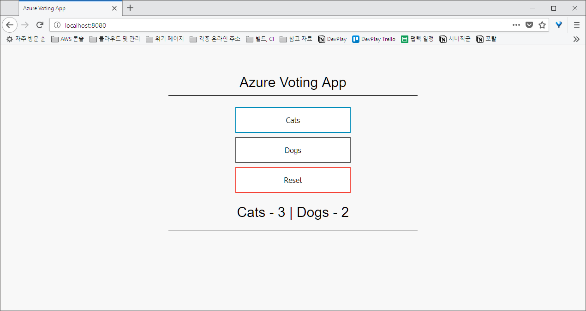
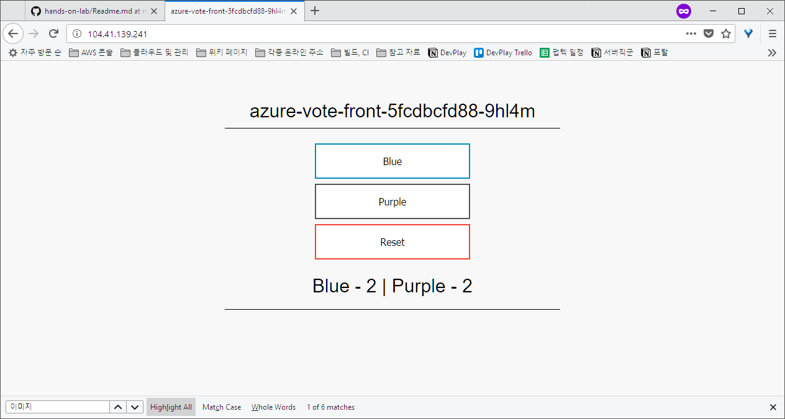
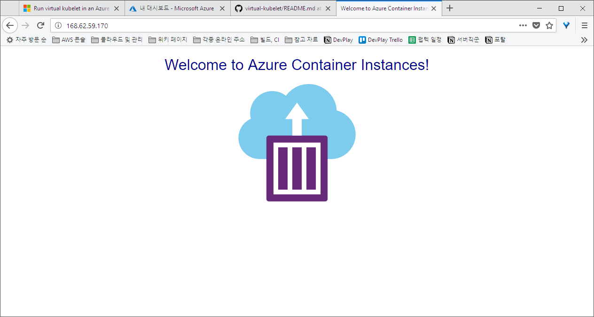
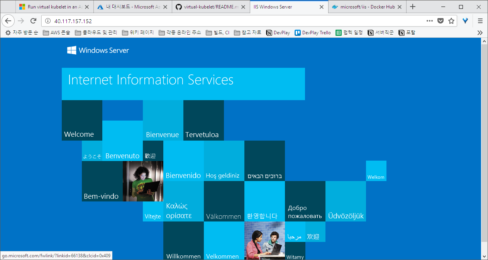

시작하기 전에: 이 모듈 이외에 OpenInfra Days 2018 오전 세션에 있었던 공동 워크샵의 발표 자료는 [slides.pdf](slides.pdf) 파일을 참고하여 주십시오.

# Azure에서 Kubernetes Service를 구축하고 Virtual Kubelet으로 컨테이너 자원 빌려오기

이 Hands-on-Lab 모듈의 내용을 따라서 Azure 상에서 관리되는 Kubernetes 클러스터를 배포하고, ACI 기반 가상 노드를 추가하여 확장성있는 Kubernetes 클러스터의 기능을 체험해보실 수 있습니다.

NOTE: 아래 예제 명령어와 코드에서 rkttu라는 문자열은 하나도 빠짐없이 여러분이 사용하실 고유한 이름으로 바꾸어주셔야 합니다. 리소스 그룹으로 격리되는 것과 별개로 이름은 전세계의 Azure 서비스에 유일한 이름이어야 합니다.

## 핸즈온랩을 시작하기 전에

이 핸즈온랩 모듈을 진행하기 위하여 미리 준비해야 할 항목들은 다음과 같습니다.

1. 샘플 응용프로그램을 빌드하고 쿠버네티스 클러스터로 보내기 위하여 우선 로컬에 Docker를 설치해야 합니다. 각 플랫폼 별로 사용할 수 있는 Docker의 버전이 서로 다르므로, 적절한 버전을 선택하여 설치를 진행하도록 합니다.

- Docker for Windows: https://store.docker.com/editions/community/docker-ce-desktop-windows
- Docker for macOS: https://store.docker.com/editions/community/docker-ce-desktop-mac
- Docker for Ubuntu: https://store.docker.com/editions/community/docker-ce-server-ubuntu
- 기타 Docker CE 버전: https://store.docker.com/search?type=edition&offering=community

주의: Windows용 Docker 설치 시 컴퓨터가 Hyper-V를 사용할 수 있는 상태여야 합니다.

2. 샘플 응용프로그램을 준비하기 위하여 Github의 리포지터리를 로컬에 Clone 해야 합니다. 이를 위하여 Git 클라이언트를 해당 플랫폼용으로 다운로드합니다.

- Git for Windows: https://git-scm.com/download/win
- Git for macOS: https://git-scm.com/download/mac
- Git for Linux: https://git-scm.com/download/linux

3. Azure 계정을 준비해야 합니다. 나누어 드린 쿠폰을 이용하여 새로운 구독을 만드시거나, 사용하시는 구독에 로그인할 수 있는지 확인하여 주십시오. 아래 웹 사이트에서 정상적으로 로그인하여 Azure 포털이 열리는지 확인하여 주십시오.

- https://portal.azure.com

4. Azure CLI 2.0을 설치해야 합니다. 해당 플랫폼에 따라 버전을 선택하여 설치하여 주십시오.

- Azure CLI 2.0 for Windows: https://docs.microsoft.com/ko-kr/cli/azure/install-azure-cli-windows?view=azure-cli-latest
- Azure CLI 2.0 for macOS: https://docs.microsoft.com/ko-kr/cli/azure/install-azure-cli-macos?view=azure-cli-latest
- Azure CLI 2.0 for Ubuntu: https://docs.microsoft.com/ko-kr/cli/azure/install-azure-cli-apt?view=azure-cli-latest
- 기타 Azure CLI 2.0 설치 방법: https://docs.microsoft.com/ko-kr/cli/azure/install-azure-cli

5. Azure CLI 2.0을 설치한 다음 아래 명령을 입력하여 로그인 프로세스를 시작합니다.

```
az login
```

6. 화면에 나오는대로 URL을 브라우저로 열어 인증 코드를 입력하고 로그인 절차를 마무리합니다.

NOTE: 만약 인증 과정에 어려움을 겪는다면, 시크릿 모드를 이용하여 새로운 브라우저 세션을 열어 인증을 진행해보세요. 문제 해결에 도움이 될 것입니다.

7. 로그인 한 계정에 대해 사용할 수 있는 구독이 여러개가 있을 수 있습니다. 정확한 구독을 선택하기 위하여 아래 명령을 입력합니다.

```
az account list
```

8. 구독이 하나만 표시되면 이 단계는 건너뛰도록 합니다. 만약 여러 개가 표시된다면, 정확히 사용하려는 구독을 찾아 그 구독의 `id` 속성의 값을 복사한 다음 아래와 같이 명령어를 입력하도록 합니다.

```
az account set --subscription "사용하려는 구독의 id"
```

9. Kubernetes 클러스터를 제어하기 위한 프로그램을 설치해야 합니다. 관리자 권한으로 콘솔을 열고 아래 명령을 입력합니다.

```
az aks install-cli
```

## Azure Kubernetes Service 테스트를 위한 응용프로그램 준비

Azure Kubernetes Service (이하 AKS)를 구동하여 실행해볼 응용프로그램을 준비해보겠습니다. 미리 준비되어있는 샘플 응용프로그램인 `azure-vote`를 사용할 것이며, 적당히 백엔드와 프론트엔드로 구분되어있어 쿠버네티스의 동작을 살펴보는데 무리가 없는 규모로 구성되어있는 샘플 응용프로그램입니다.

1. `azure-vote` 리포지터리를 로컬에 복사합니다.

```
git clone https://github.com/Azure-Samples/azure-voting-app-redis.git
```

2. 디렉터리를 이동합니다.

```
cd azure-voting-app-redis
```

3. 리포지터리에 포함되어있는 `docker-compose.yaml` 파일의 내용대로 로컬에 클러스터를 바로 띄워볼 수 있습니다. 아래 명령을 입력합니다.

```
docker-compose up -d
```

NOTE: 만약 Windows용 Docker에서 이미지 Pull이 실패한다면, 현재 실행 중인 Docker가 Windows 컨테이너 지원 모드이기 때문일 수 있습니다. Docker 트레이 아이콘을 찾아 마우스 오른쪽 버튼으로 클릭하고, `Switch to Linux Containers` 메뉴를 선택하고 기다립니다.

4. 모든 이미지들이 정상적으로 다운로드되었는지 확인하기 위하여 아래 명령을 입력합니다.

```
docker images
```

5. 그리고 컨테이너들이 모두 실행 중인지 확인하기 위하여 아래 명령을 입력합니다.

```
docker ps
```

6. 컨테이너 목록의 `PORTS` 열에 나와있는 것과 같이 현재 `8080` 포트로 웹 서버가 열려있을 것입니다. 웹 브라우저로 아래 주소에 접속해봅니다.

```
http://localhost:8080
```

7. 아래 그림과 같이 화면이 표시되고, `Cats`나 `Dogs` 버튼을 눌렀을 때 숫자 값이 증가하면 정상 작동하는 것입니다.



8. 애플리케이션이 정상 작동하는 것을 확인하였으므로 아래 명령을 입력하여 클러스터를 종료합니다.

```
docker-compose stop
```

9. 클러스터의 구성 요소들을 모두 지우기 위하여 아래 명령을 입력합니다.

```
docker-compose down
```

## Azure Container Registry 생성하고 이미지 넣기

AKS에 새로운 프로그램을 배포하기 위해서는 Azure Container Registry (이하 ACR)에 컨테이너 이미지를 추가해야 합니다. 또한 앞으로 만들 AKS와 ACR을 관리할 새로운 리소스 그룹도 만들어야 합니다.

1. 다음 명령을 입력하여 새로운 리소스 그룹을 만듭니다.

```
az group create -n my-aks-test -l eastus
```

2. 새로운 ACR을 방금 만든 리소스 그룹 아래에 생성합니다. 아래의 `rkttu` 대신 여러분만의 고유한 이름으로 변경합니다.

```
az acr create -g my-aks-test -n rkttu --sku Basic
```

3. Docker 클라이언트가 ACR에 접근할 수 있도록 로그인시켜야 합니다. 이 과정을 대행해주는 명령어를 입력합니다.

```
az acr login -n rkttu
```

4. ACR로 전송하려는 컨테이너 이미지를 확인하기 위하여 아래 명령어를 입력합니다.

```
docker images
```

5. 방금 만든 ACR의 로그인 서버 주소를 확인하여 다음과 같이 `azure-vote-front` 이미지에 새 태그를 추가합니다. `rkttu` 대신 여러분이 만든 ACR 이름을 입력합니다.

```
docker tag azure-vote-front:latest rkttu.azurecr.io/azure-vote-front:v1
```

6. 추가한 태그의 이미지를 ACR로 전송하기 위하여 다음 명령을 입력합니다. `rkttu` 대신 여러분이 만든 ACR 이름을 입력합니다.

```
docker push rkttu.azurecr.io/azure-vote-front:v1
```

7. 이미지가 잘 전달되었는지 확인하기 위하여 다음 명령을 입력합니다. `rkttu` 대신 여러분이 만든 ACR 이름을 입력합니다.

```
az acr repository list --name rkttu
az acr repository show-tags --name rkttu --repository azure-vote-front --output table
```

## Azure Kubernetes Service 클러스터 만들기

이제 AKS 클러스터를 만들 차례입니다.

1. 아래의 명령을 입력하여 새 AKS 클러스터를 생성합니다. `rkttucluster` 대신 여러분의 AKS 클러스터 이름을 입력합니다. 빠른 생성과 테스트를 위하여 일단 처음은 1개 작업자 노드를 만드는 것으로 시작합니다.

az aks create -g my-aks-test -n rkttucluster --node-count 1 --generate-ssh-keys

2. 나중에 진단 등의 목적으로 노드에 직접 SSH로 접속할 것을 대비하여, 자동으로 만들어진 SSH 키를 안전한 곳에 백업하도록 합니다. 만약 기존에 키를 만들어둔 것이 없다면, 보통 홈 디렉터리 아래의 .ssh 폴더에 자동으로 생성되므로 이 키를 백업하도록 합니다.

3. `kubectl` 프로그램을 이용할 수 있도록 아래의 명령을 이용하여 크레덴셜 정보 및 컨텍스트 정보를 다운로드합니다. `rkttucluster` 대신 여러분의 AKS 클러스터 이름을 입력합니다.

```
az aks get-credentials -g my-aks-test -n rkttucluster
```

4. 기존에 여러 개의 컨텍스트를 사용 중이었을 수 있으므로, 컨텍스트가 잘 병합되었는지 확인하고, 새로 만들어진 컨텍스트를 선택합니다.

```
kubectl config get-contexts
```

5. 새로 만들어진 컨텍스트 앞에 CURRENT 열에 `*` 문자가 표시되어 있는지 확인하고, 표시되어있지 않으면 아래 명령을 입력합니다. `rkttucluster` 대신 여러분의 AKS 클러스터 이름을 입력합니다.

```
kubectl config use-context rkttucluster
```

6. 아래 명령을 입력하여 1개의 노드가 정상 실행 중인지 확인합니다.

```
kubectl get nodes
```

7. ACR과 AKS를 연동하는 작업을 진행해야 합니다. 우선 AKS의 서비스 주체 ID 값을 확인하기 위하여 아래 명령을 실행하고, 나타나는 값을 메모합니다. `rkttucluster` 대신 여러분의 AKS 클러스터 이름을 입력합니다.

```
az aks show -g my-aks-test -n rkttucluster --query "servicePrincipalProfile.clientId" -o tsv
```

8. 이어서 ACR의 리소스 ID 값을 확인하기 위하여 아래 명령을 실행하고 결과값을 메모합니다. `rkttu` 대신 여러분의 ACR 이름을 입력합니다.

```
az acr show -n rkttu -g my-aks-test --query "id" -o tsv
```

9. 7단계에서 확인한 값을 아래의 `CLIENT_ID` 부분 대신 넣고, 8단계에서 확인한 값을 아래의 `ACR_ID` 부분 대신 넣어 명령을 실행합니다.

```
az role assignment create --assignee "CLIENT_ID" --role Reader --scope "ACR_ID"
```

## 샘플 프로그램 배포하기

이제 샘플 프로그램을 배포할 차례입니다. 앞의 단계에서 가져온 git 리포지터리의 디렉터리로 이동합니다.

1. `azure-vote-all-in-one-redis.yaml` 파일을 텍스트 편집기로 엽니다.

2. 다음의 부분에서 `azure-vote-front` 컨테이너의 이미지를 Microsoft의 것에서 ACR의 이미지로 변경합니다. `rkttu` 대신 여러분이 만든 ACR의 이름을 입력합니다.

변경 전

```
containers:
- name: azure-vote-front
  image: microsoft/azure-vote-front:v1
```

변경 후

```
containers:
- name: azure-vote-front
  image: rkttu.azurecr.io/azure-vote-front:v1
```

3. 파일을 저장한 다음, 아래 명령을 실행하여 배포를 진행합니다.

```
kubectl apply -f azure-vote-all-in-one-redis.yaml
```

4. 아래 명령을 실행하여 배포 상황을 모니터링합니다. `EXTERNAL-IP`가 `<pending>` 에서 정확한 IP 주소로 확정되면 완료된 것이며, 이 때 `Ctrl+C` 키를 눌러 종료합니다.

```
kubectl get service azure-vote-front --watch
```

5. Pod의 상태를 확인해봅니다. 최초에 ACR 연동 과정에서 정보가 동기화되지 않아 오류가 발생할 수는 있으나, 오류가 해결될 때 까지 잠시 기다려봅니다.

```
kubectl get pod --watch
```

6. 4단계에서 확인한 `EXTERNAL-IP` 주소를 복사하여 브라우저에서 접속해봅니다.



## 클러스터 크기 증설하기

Kubernetes 클러스터에서 가장 큰 장점은 노드의 추가와 제거를 직접하지 않고 명령어 하나로 손쉽게 제어할 수 있다는 점입니다. 그리고 이 과정에서 발생하는 서비스 재배치도 전부 자동화되어있어서, 정책적으로 Single Point of Failure가 발생하지 않도록 항상 여분의 리소스를 배치하여 활용할 수 있게 하면 사실상 무중단의 서비스를 구사할 수 있습니다.

1. 처음에 배포한 1개의 노드에서 3개의 노드로 확장하기 위하여 아래 명령을 입력하고 기다립니다. `rkttucluster` 대신 여러분이 만든 AKS 클러스터 이름으로 변경합니다.

```
az aks scale -g my-aks-test -n rkttucluster --node-count 3
```

2. 노드의 구동 상태를 확인하기 위하여 아래 명령을 입력합니다.

```
kubectl get nodes -o wide
```

3. 앞에서 배포한 `azure-vote-front` Deployment를 5개로 늘리기 위하여 아래 명령을 입력합니다.

```
kubectl scale --replicas=5 deployment/azure-vote-front
```

4. Pod의 배포 상황을 확인하기 위하여 아래 명령을 입력합니다.

```
kubectl get pods --watch -o wide
```

5. 각 노드 별로 골고루 Pod이 배포되었는지 `NODE` 컬럼의 값들을 확인해봅니다.

## 샘플 프로그램 업데이트하기

처음에 배포한 `Cats vs. Dogs` 투표에서 후보를 `Blue vs. Purple`로 변경하여 업데이트를 진행해보도록 하겠습니다.

1. `azure-vote/azure-vote/config_file.cfg` 파일을 텍스트 편집기로 열어서, 아래와 같이 수정합니다.

변경 전

```
# UI Configurations
TITLE = 'Azure Voting App'
VOTE1VALUE = 'Cats'
VOTE2VALUE = 'Dogs'
SHOWHOST = 'false'
```

변경 후

```
# UI Configurations
TITLE = 'Azure Voting App v2'
VOTE1VALUE = 'Blue'
VOTE2VALUE = 'Purple'
SHOWHOST = 'true'
```

2. 로컬에서 정상적으로 반영되었는지 확인하고, 이미지도 다시 빌드하기 위하여 아래 명령을 입력합니다.

```
docker-compose up --build -d
```

3. 웹 브라우저로 열어 정상적으로 내용이 고쳐졌는지 확인합니다.

4. 이미지가 새로 만들어졌으므로, 기존 이미지와는 다르게 태그 이름을 `v2`로 설정하여 ACR로 전송하겠습니다. 아래의 명령어를 입력하되, `rkttu` 대신 여러분의 ACR 이름으로 변경합니다.

```
docker tag azure-vote-front:latest rkttu.azurecr.io/azure-vote-front:v2
docker push rkttu.azurecr.io/azure-vote-front:v2
```

5. Deployment에서 선택한 컨테이너의 이미지를 새 버전으로 변경하기 위하여 아래 명령을 입력합니다. `rkttu` 대신 여러분의 ACR 이름으로 변경합니다.

```
kubectl set image deployment azure-vote-front azure-vote-front=rkttu.azurecr.io/azure-vote-front:v2
```

6. Pod이 순차적으로 업데이트되는 것을 확인하기 위하여 아래 명령을 입력합니다.

```
kubectl get pod -o wide --watch
```

7. 다시 한 번 웹 브라우저로 접속하여 새로 바뀐 후보 이름으로 웹 사이트가 표시되는지 확인해봅니다.

## Virtual Kubelet 설치하기

Virtual Kubelet은 앞서 만든 ACR이나 AKS와는 또 다른 Azure Container Instane (이하 ACI)를 기반으로 제공되는 서비스이며, ACI를 Virtual Kubelet과 연동하여 마치 Kubernetes에 새로운 노드 컴퓨터가 추가된 것 처럼 활용합니다. 이 때, ACI는 리눅스와 Windows 컨테이너를 모두 지원하므로, AKS에서 Windows 응용프로그램을 쉽게 호스팅할 수 있게 됩니다.

1. Virtual Kubelet은 Helm을 기반으로 설치를 진행합니다. 아래 명령을 입력하여 초기화를 진행합니다.

```
helm init
```

2. 현재 버전의 Virtual Kubelet의 문제를 회피하기 위하여 추가로 진행해야 하는 단계가 있습니다. 아래 명령을 입력하여 AKS를 만들면서 자동으로 생성된 새 리소스 그룹의 이름을 메모합니다.

```
az group list
```

3. Virtual Kubelet을 배포해야 합니다. 아래 명령을 입력하되, `rkttucluster` 대신 여러분이 만든 AKS 클러스터 이름을 입력합니다. 그리고 `--aci-resource-group` 스위치 다음에는 2단계에서 확인한 이름을 대입합니다.

```
az aks install-connector -g my-aks-test -n rkttucluster --connector-name virtual-kubelet --os-type Both --aci-resource-group MC_my-aks-test_rkttucluster_eastus
```

3. 가상 노드가 잘 추가되었는지 확인하기 위하여 아래 명령을 입력합니다.

```
kubectl get nodes -o wide
```

## Linux 가상 노드에 Pod 배포하고 실행하기

Linux 가상 노드를 추가하였으므로, 아래의 샘플 프로그램을 배포하고 실행하는 것이 잘 되는지 확인해보겠습니다.

1. 아래와 같이 `vklinux.yaml` 파일을 작성합니다.

```
apiVersion: apps/v1beta1
kind: Deployment
metadata:
  name: aci-helloworld
spec:
  replicas: 1
  template:
    metadata:
      labels:
        app: aci-helloworld
    spec:
      containers:
      - name: aci-helloworld
        image: microsoft/aci-helloworld
        ports:
        - containerPort: 80
      nodeSelector:
        kubernetes.io/hostname: virtual-kubelet-virtual-kubelet-linux
      tolerations:
      - key: azure.com/aci
        effect: NoSchedule
```

2. Linux 가상 노드에 배포를 진행해보겠습니다.

```
kubectl apply -f vklinux.yaml
```

3. Pod이 만들어지기까지 확인하고 IP 주소를 얻기 위하여 아래 명령을 입력합니다.

```
kubectl get pods -o wide --watch
```

4. `IP` 컬럼에 새로 만들어진 Pod의 주소가 나타나면 웹 브라우저를 열고 접속해봅니다.



## Windows 가상 노드에 IIS Pod 배포하고 실행하기

Windows 가상 노드를 추가하였으므로, IIS Pod을 배포하고 실행하는 것이 잘 되는지 확인해보겠습니다.

1. 아래와 같이 `vkwindows.yaml` 파일을 작성합니다.

```
apiVersion: apps/v1beta1
kind: Deployment
metadata:
  name: nanoserver-iis
spec:
  replicas: 1
  template:
    metadata:
      labels:
        app: nanoserver-iis
    spec:
      containers:
      - name: nanoserver-iis
        image: microsoft/iis:nanoserver
        ports:
        - containerPort: 80
      nodeSelector:
        kubernetes.io/hostname: virtual-kubelet-virtual-kubelet-win
      tolerations:
      - key: azure.com/aci
        effect: NoSchedule
```

2. Windows 노드에 배포를 진행합니다.

```
kubectl apply -f vkwindows.yaml
```

3. Pod이 만들어지기까지 확인하고 IP 주소를 얻기 위하여 아래 명령을 입력합니다.

```
kubectl get pods -o wide --watch
```

4. `IP` 컬럼에 새로 만들어진 Pod의 주소가 나타나면 웹 브라우저를 열고 접속해봅니다.


