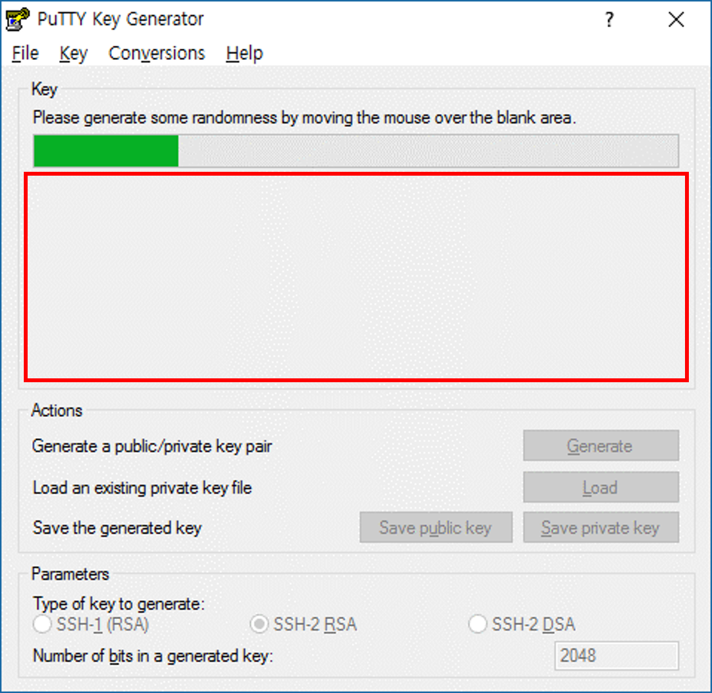

# 0.2 SSH Key 생성
Linux에 연결할 때 보통 SSH(Secure SHell)을 이용합니다. 특히 SSH로 연결할 시 ID/PW로 연결하는 방법도 있습니다만, Password의 보안적 문제로 인해 SSH Key pair로 연결하는 것이 보안적으로 더 좋다고 권장합니다.

이번 내용에서는 Linux VM을 만들 때 사용할 SSH Key Pair를 생성하여 활용하기 위한 준비를 해 보겠습니다.

## Putty를 이용한 SSH Key Pair 만들기
1. [Putty 다운로드 페이지](http://www.chiark.greenend.org.uk/~sgtatham/putty/latest.html)에서 `puttygen.exe` 파일을 다운로드 받습니다.
    - [32-bit download](https://the.earth.li/~sgtatham/putty/latest/w32/puttygen.exe)
    - [64-bit download](https://the.earth.li/~sgtatham/putty/latest/w64/puttygen.exe)

2. 다운로드 한 `puttygen.exe`를 실행합니다.

3. 상단 메뉴에 **Key**메뉴를 클릭한 후 **SSH-2 RSA key**가 선택 되어있는지 확인하고 **Generation key pair**를 선택합니다.

4. 아래와 같이 **Please generate some rendomness by moving the mouse over the blank area.** 가 뜨면 **빨강색 네모 부분**에 **Key가 생성될 때 까지 마우스를 계속해서 움직**여 줍니다.


5. 생성이 완료되면 상단 메뉴에서 **File**을 클릭한 후 **Save public key**를 클릭하여 **.ppk 파일**로 저장합니다.
    - 나중에 VM을 만들 때 해당 파일을 사용합니다.

6. 상단 메뉴에서 **File**을 클릭한 후 **Save private key**를 클릭하여 **.pem 파일**로 저장합니다.
    - 나중에 Linux에서 SSH를 이용하여 접속할 때 필요합니다.

## Linux SSH를 이용한 SSH Key Pair 만들기
1. bash를 실행합니다.

2. 다음과 같은 명령어를 사용하여 SSH Key-pair를 생성합니다.
    ```bash
    ssh-keygen
    ```

3. **Enter file in which to save the key (/home/ubuntu/.ssh/id_rsa):** 가 나오면 Key를 저장할 경로를 입력합니다.
    - 예) ~/.ssh/key

4. **Enter passphrase (empty for no passphrase):** 가 나오면 Key를 생성할 때 사용할 **비밀번호**를 입력합니다.

5. **Enter same passphrase again:** 이 나오면 `4번`에서 입력한 **비밀번호**를 다시 입력합니다.

6. SSH key pair가 정상적으로 생성되었는지 확인합니다.