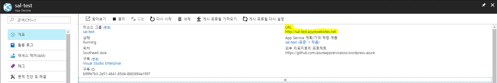

# 1.1 Wordpress on 웹앱+MySQL 만들기(진행중)
Azure 웹앱을 구성해 보고 MySQL용 Azure 데이터베이스 연결을 학습하기 위해 기존 ARM인 Wordpress를 가지고 실습을 합니다.

이번 내용에서는 Azure 웹앱에 대해 살펴보고, 새로 나온 MySQL용 Azure 데이터베이스를 웹앱에 연결하여 사용하는 방법에 대해 알아보고, 각 리소스별 특징과 속성에 대하여 알아보겠습니다. 각 리소스의 장단점을 생각하면서 보시면 더욱 이해하시는 데에 좋을 것이라고 생각합니다.

## 웹 콘솔에서 Wordpress on 웹앱+MySQL 만들기
1. [Azure 웹 콘솔](https://portal.azure.com)에 접속합니다.

2. 먼저 **리소스 그룹**을 만듭니다. 좌측 메뉴에서 **리소스 그룹**을 선택합니다.
    > [!메모]
    >
    > 좌측 메뉴에 **리소스 그룹**이 없다면, 하단의 More Service를 선택 한 후 **resources**을 검색하여 선택합니다.

3. 블레이드에 **리소스 그룹**창이 뜨면 상단에 **+추가**버튼을 눌러서 **리소스 그룹**을 생성합니다.

4. **리소스 그룹 만들기** 블레이드가 뜨면 아래와 같이 설정을 입력합니다.
     - `리소스 그룹 이름` : 표시 될 리소스 그룹 이름을 입력합니다. 여기서는 sal-&lt;ID&gt;로 입력하겠습니다.
     - `구독` : 리소스 그룹을 생성할 구독을 선택합니다.
     - `리소스 그룹 위치` : 리소스 그룹을 생성할 지역을 선택합니다. 여기서는 **아시아 남동부**에 만들겠습니다.

5. 하단의 **만들기**버튼을 클릭하여 리소스 그룹을 생성합니다.

6. **새로 고침** 버튼을 클릭하여 생성한 **리소스 그룹**이 정상적으로 생성 되었는지 확인합니다.

7. 좌측 메뉴에서 **새로 만들기**를 선택합니다.

8. 블레이드에 **새로 만들기**창이 뜨면 상단에 **검색창**에서 **wordpress**를 입력한 후 엔터를 입력합니다.

9. **wordpress 검색 결과**가 뜨면 **Wordpress**를 클릭합니다.

10. **Wordpress** 블레이드가 뜨면 하단에 **만들기**버튼을 클릭합니다.

11. **Wordpress 만들기**블레이드가 뜨면 다음과 같이 정보를 입력한 후 하단에 **대시보드 고정**을 체크한 후 **만들기**버튼을 클릭합니다.
    - `앱 이름` : 표시 될 앱 이름을 입력합니다. 앱 이름은 고유해야 합니다. 여기서는 sal-&lt;ID&gt;로 입력하겠습니다.
    - `구독` : 앱을 생성할 구독을 선택합니다.
    - `리소스 그룹` : **기존 그룹 사용**을 선택하신 후 드롭 다운 메뉴에서 이전에 생성한 리소스 그룹을 선택합니다.
    - `데이터베이스 공급자` : Wordpress의 데이터베이스를 선택합니다. 여기서는 MySQL용 Azure Database(Preview)를 선택합니다.
    - `App Service 계획/위치` : 선택을 하면 오른쪽에 새로운 블레이드가 뜹니다. **새로 만들기**를 클릭한 후 **새 App Service 계획** 블레이드가 뜨면 다음과 같이 정보를 입력한 후 **확인**버튼을 클릭합니다.
        - `App Service 계획` : 표시 될 App Service 계획의 이름을 입력합니다. 여기서도 sal-&lt;ID&gt;로 입력하겠습니다.
        - `위치` : 생성한 **리소스 그룹**과 동일한 지역을 선택합니다. 여기서는 Southeast Asia를 선택합니다.
        - `가격 책정 계층` : App Service 계획을 만들기 위한 성능을 선택합니다. 기본 값은 S1 표준을 그대로 둡니다.
    - `데이터베이스` : 선택을 하면 오른쪽에 **데이터베이스 서버** 블레이드가 뜹니다. 다음과 같이 정보를 입력한 후 **확인**버튼을 클릭합니다.
        - `서버 이름` : 표시 될 데이터베이스 인스턴스의 이름을 입력합니다. 여기서는 기본 값인 sal-&lt;ID&gt;-mysqldbserver 이름을 그대로 둡니다.
        - `서버 관리자 로그인 이름` : MySQL 데이터베이스 인스턴스에 접근할 계정을 입력합니다.
        - `암호` : MySQL 데이터베이스 인스턴스에 접근할 비밀번호를 입력합니다.
        - `암호 확인` : 입력한 비밀번호를 다시 입력합니다.
        - `버전` : MySQL 데이터베이스 인스턴스의 버전을 선택합니다. 5.7을 선택합니다.
        - `가격 책정 계층` : MySQL 데이터베이스 인스턴스를 만들기 위한 성능을 선택합니다. 현재 Preview여서 기본값을 그대로 둡니다.
        - `데이터베이스 이름` : 사용 할 데이터베이스의 이름을 입력합니다. 특수기호는 포함하지 않습니다. 최초 Azure에서 MySQL 데이터베이스를 생성해 주는 옵션이며, 추후 MySQL 데이터베이스 인스턴스에 접속하여 MySQL 데이터베이스를 생성/삭제가 가능합니다. 여기서는 wordpressdb를 입력합니다.
    - `Application Insights` : 해제

12. **Wordpress** 배포가 완료되면 화면에 표시된 웹앱 블레이드에서 우측에 **URL**에 표시된 주소를 클릭하여 **Wordpress 홈페이지**에 접속합니다.
    > [!메모]
    >
    > 앱이 로딩되는데 약간의 시간이 필요할 수 있습니다.

13. **Wordpress**창이 뜨면 정보를 입력하여 **Wordpress**를 설정해 줍니다. 언어는 한국어를 선택합니다.
    - `언어` : 한국어
    - `사이트 제목` : Wordpress의 사이트 제목을 입력합니다. 여기서는 sal-&lt;ID&gt;를 입력합니다.
    - `사용자명` : Wordpress 관리자 ID를 생성합니다. 이메일이 아닌 ID를 입력합니다.
    - `비밀번호` : 기본적으로 Wordpress에서 비밀번호를 생성해 줍니다. 개인이 자주 사용하는 비밀번호로 변경합니다.
    - `이메일 주소` : 이메일 주소를 입력합니다. Wordpress에 SMTP가 설정되어있지 않기 때문에 메일은 수신되지 않습니다.
    - `검색 엔진 접근 여부` : 여기서는 **검색 엔진이 이 사이트 검색 차단하기** 체크박스에 체크를 하겠습니다.

14. 설정이 완료되면 **Wordpress**에 로그인 합니다.

15. 좌측 네비게이터에서 **업데이트**를 클릭한 후 업데이트가 가능한 플러그인을 업데이트 합니다.

16. 좌측 네비게이터에서 **플러그인**를 클릭한 후 **플러그린 추가하기**를 클릭합니다.

17. 우측 상단 검색창에 smtp를 입력하고 엔터를 입력하여 검색합니다.

18. **Easy WP SMTP**의 **지금 설치하기**버튼을 클릭합니다.

19. 좌측 네비게이터에서 **글**을 클릭한 후 **새 글 쓰기**를 클릭하여 아무 글이나 게시합니다.

20. **Wordpress 홈페이지**를 닫고 **Azure Portal**로 돌아옵니다.

21. sal-&lt;ID&gt; 웹앱 블레이드에서 **개요**, **배포 옵션**, **응용 프로그램 설정**, **고급 도구**, **콘솔**. **프로덕션에서 테스트** 등을 클릭하면서 구성된 웹앱 정보들을 확인합니다.

22. sal-&lt;ID&gt; 웹앱 블레이드에서 **속성**을 클릭합니다. 찾기 어렵다면 sal-&lt;ID&gt; 웹앱 블레이드 상단에 검색창에 **속성**을 입력합니다.

23. 우측에 **속성** 창이 뜨면 **가상 IP 주소**와 **아웃바운드 IP 주소**를 복사하여 메모장에 입력해 둡니다.

24. Azure Portal 좌측 메뉴에서 **리소스 그룹**을 클릭하고 생성한 sal-&lt;ID&gt; 리소스 그룹을 선택합니다.

25. sal-&lt;ID&gt; 리소스 그룹 블레이드가 뜨면, MySQL 서버용 Azure 데이터베이스인 sal-&lt;ID&gt;-mysqldbserver를 클릭합니다.

26. sal-&lt;ID&gt;-mysqldbserver 블레이드가 뜨면 좌측 네비게이터에서 **연결 보안**을 클릭합니다.

27. **연결 보안** 블레이드가 뜨면 **방화벽 규칙**에 이전에 메모장에 복사한 IP를 다음과 같이 입력한 후 기존 정책인 **AllowAll**에서 마우스 오른쪽 버튼을 클릭한 후 **삭제**를 클릭합니다. 입력이 완료되면 블레이드 상단에 **저장**버튼을 클릭하여 설정을 저장합니다.
    - `규칙 이름` : 표시 될 규칙 이름을 입력합니다. 여기서는 sal-&lt;ID&gt;-IP01~05까지 입력합니다.
    - `시작 IP` : 메모장에 복사한 IP중 하나를 입력합니다.
    - `종료 IP` : `시작 IP`와 동일한 IP를 입력합니다.

28. sal-&lt;ID&gt;-mysqldbserver 블레이드에서 **개요**, **연결 문자열**, **서버 매개변수**, **속성**등을 클릭하면서 구성된 MySQL 데이터베이스 인스턴스 정보들을 확인합니다.

29. 새로운 인터넷 브라우저 창을 띄운 후 http://sal-<ID>.azurewebsites.net를 입력하여 생성한 **Wordpress 홈페이지**에 정상적으로 접근이 되는지 확인합니다.
    > [!메모]
    >
    > Azure Portal에서는 이전에 생성한 sal-&lt;ID&gt; 웹앱 블레이드로 돌아가서 **URL**을 클릭하여 접근할 수도 있습니다.