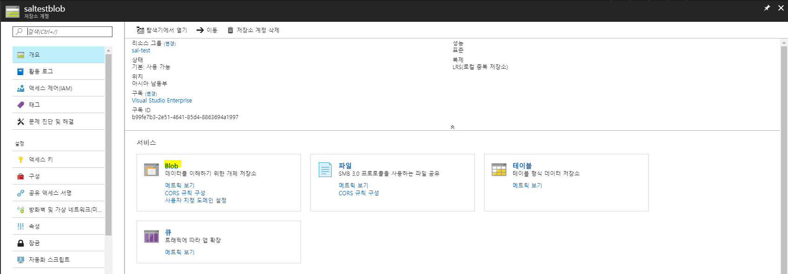

# 1.2 웹앱 백업 구성(진행중)
Azure 웹앱에서 백업을 구성해 봅니다. 이 실습은 반드시 [#1.1 Wordpress on 웹앱+MySQL 만들기](https://github.com/krazure/hands-on-lab/blob/master/SAL%201711%20Azure%20%EC%9B%B9%EC%95%B1%EA%B3%BC%20%EB%84%A4%ED%8A%B8%EC%9B%8C%ED%81%AC%20%EB%94%94%EC%9E%90%EC%9D%B8%2C%20%EA%B7%B8%EB%A6%AC%EA%B3%A0%20%EB%A6%AC%EB%88%85%EC%8A%A4/1.1%20Wordpress%20on%20%EC%9B%B9%EC%95%B1%2BMySQL%20%EB%A7%8C%EB%93%A4%EA%B8%B0.md)를 실습하고 난 다음에 해 주시기 바랍니다.

이번 내용에서는 구성된 Wordpress(또는 웹앱)를 백업하는 방법에 대해 알아보고, 백업을 실행하여 어떻게 Wordpress(또는 웹앱)를 백업하는지 알아보겠습니다. 따라하는 것만 집중하지 말고 하나하나 차근차근 보시면서 따라하시면 이해하시는데 도움이 되실 것 입니다.

## 웹 콘솔에서 웹앱 백업 구성
1. [Azure 웹 콘솔](https://portal.azure.com)에 접속합니다.

2. 좌측 메뉴에서 **새로 만들기**를 선택합니다.

3. 블레이드에 **새로 만들기**창이 뜨면 상단에 **검색창**에서 **저장소**를 입력한 후 엔터를 입력합니다.

4. **저장소 검색 결과**가 뜨면 **Storage 계정 - Blob, File, Table, Queue**를 클릭합니다.

5. **Storage 계정 - Blob, File, Table, Queue 만들기** 블레이드가 뜨면 하단에 **만들기**버튼을 클릭합니다.

6. **저장소 계정 만들기** 블레이드가 뜨면 다음과 같이 정보를 입력한 후 하단에 하단에 **대시보드 고정**을 체크한 후 **만들기**버튼을 클릭합니다.
    - `이름` : 저장소 계정이 표시 될 이름을 입력합니다. 특수기호는 포함하지 않습니다. 저장소 계정 이름은 고유해야 합니다. 여기서는 sla&lt;ID&gt;blob으로 생성합니다.
    - `배포 모델` : 저장소 계정이 배포될 모델을 선택합니다. 현재 클래식 포털은 되도록 사용하지 않는 것을 추천드립니다. 여기서는 Resource Manager를 선택합니다.
    - `계정 종류` : 저장소 계정의 종류를 선택합니다. 표준은 Blob, File, Table, Queue를 전부 사용할 수 있으며, Blob 저장소는 Blob만 사용 가능하도록 특화된 저장소 계정을 생성합니다. 여기서는 표준을 선택합니다.
    - `성능` : 저장소 계정의 성능을 선택합니다. 여기서는 표준을 선택합니다.
    - `복제` : 저장소 계정의 복제 설정을 선택합니다. 여기서는 LRS(로컬 중복 저장소)를 선택합니다.
    - `보안 전송 필요` : 사용 안 함
    - `구독` : 저장소 계정을 생성할 구독을 선택합니다.
    - `리소스 그룹` : **기존 그룹 사용**을 선택하신 후 드롭 다운 메뉴에서 이전에 생성한 리소스 그룹(sal-&lt;ID&gt;)을 선택합니다.
    - `위치` : 저장소 계정을 생성할 위치를 선택합니다. 여기서는 **아시아 남동부**에 만들겠습니다.
    - `가상 네트워크(미리 보기)` : 사용 안 함

7. 좌측 메뉴에서 **리소스 그룹**을 클릭하고 생성한 sal-&lt;ID&gt; 리소스 그룹을 선택합니다. sal-&lt;ID&gt; 리소스 그룹 블레이드가 뜨면 방금 생성한 저장소 계정인 sla&lt;ID&gt;blob을 클릭합니다.

8. sla&lt;ID&gt;blob 블레이드가 뜨면 **서비스**영역에 **Blob**을 클릭합니다.

9. **Blob service** 블레이드가 뜨면 상단에 **컨테이너**버튼을 클릭합니다. **새 컨테이너**창이 뜨면 아래와 같이 정보를 입력한 후 **확인**버튼을 클릭합니다.
    - `이름` : 표시 될 Blob 컨테이너 이름을 입력합니다. 여기서는 `backup`으로 입력하겠습니다.
    - `공용 액세스 수준` : Blob 컨테이너에 접근 권한을 설정합니다. 여기서는 개인(익명 액세스 없음)을 선택합니다.

10. [#1.1 Wordpress on 웹앱+MySQL 만들기](https://github.com/krazure/hands-on-lab/blob/master/SAL%201711%20Azure%20%EC%9B%B9%EC%95%B1%EA%B3%BC%20%EB%84%A4%ED%8A%B8%EC%9B%8C%ED%81%AC%20%EB%94%94%EC%9E%90%EC%9D%B8%2C%20%EA%B7%B8%EB%A6%AC%EA%B3%A0%20%EB%A6%AC%EB%88%85%EC%8A%A4/1.1%20Wordpress%20on%20%EC%9B%B9%EC%95%B1%2BMySQL%20%EB%A7%8C%EB%93%A4%EA%B8%B0.md)에서 생성한 웹앱 블레이드로 이동합니다.
    > [!메모]
    >
    > 좌측 메뉴에서 **리소스 그룹**을 클릭하고 생성한 sal-&lt;ID&gt; 리소스 그룹을 선택합니다. sal-&lt;ID&gt; 리소스 그룹 블레이드가 뜨면 sal-&lt;ID&gt; App Service를 클릭합니다.

11. sal-&lt;ID&gt; 웹앱 블레이드가 뜨면 네비게이터에서 **백업**을 클릭합니다. 찾기 어렵다면 sal-&lt;ID&gt; 웹앱 블레이드 상단에 검색창에 **백업**을 입력합니다.

12. **백업**이 뜨면 상단에 **구성** 또는 가운데 **백업이 구성되어 있지 않습니다. 앱에 대한 백업을 구성하려면 여기를 클릭하세요.**를 클릭합니다.

13. **백업 구성** 블레이드가 뜨면 아래와 같이 정보를 입력한 후 하단에 **저장**버튼을 클릭합니다.
    - `백업 저장소` : 웹앱 백업이 저장될 저장소 계정을 선택합니다. **저장소가 구성되지 않음**을 클릭합니다. **저장소 계정**블레이드가 뜨면 이전에 생성한 sla&lt;ID&gt;blob을 클릭합니다. 우측에 **컨테이너**블레이드가 뜨면 이전에 생성한 backup 컨테이너를 선택한 후 하단에 **선택**버튼을 클릭합니다.
    - `백업 일정` : 자동으로 백업을 할 수 있도록 백업 주기를 설정합니다. 여기서는 끄기를 선택합니다.
    - `데이터베이스 백업` : 웹앱에 연결된 데이터베이스의 백업 여부를 설정합니다. 여기서는 체크박스에 체크를 하여 데이터베이스 백업을 포함하겠습니다.

14. 구성이 완료되면 가운데 **백업**버튼을 클릭하여 웹앱 사이트 백업을 실행합니다. 웹앱 사이트 백업시 약간의 성능 저하가 발생할 수 있습니다.
    > [!메모]
    >
    > 웹앱 백업은 WebJob으로 동작합니다.

15. 실행한 웹앱 백업의 상태가 **진행 중**에서 **성공**이 될 때 까지 기다립니다.
    > [!메모]
    >
    > 상단의 **새로 고침**버튼을 클릭하면서 상태가 업데이트 되는지를 확인합니다.

16. 성공한 백업을 클릭하여 **백업 복원**블레이드가 뜨면 정보를 확인합니다.