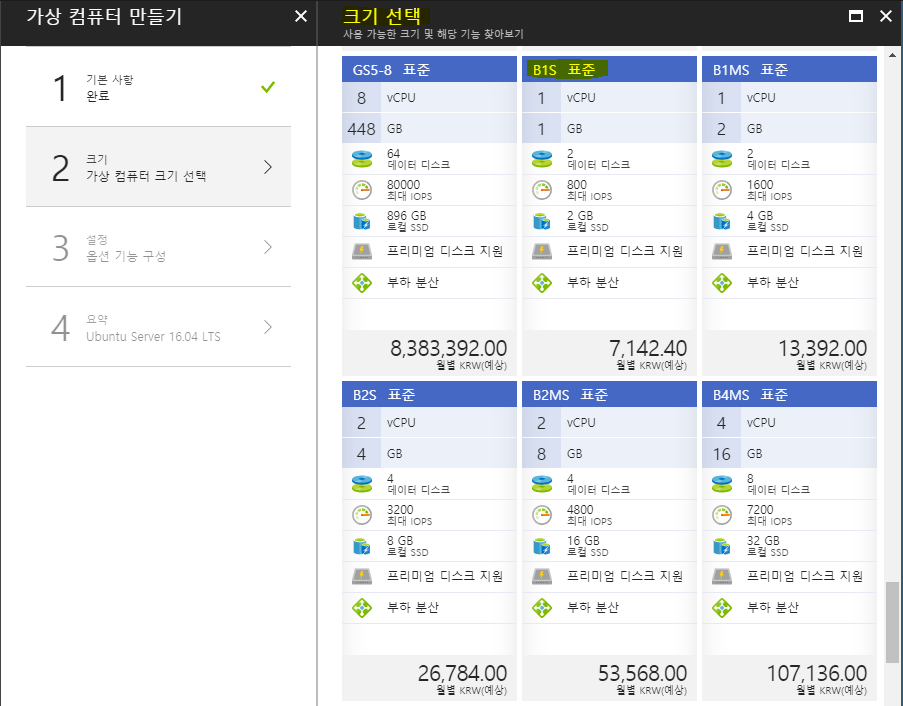
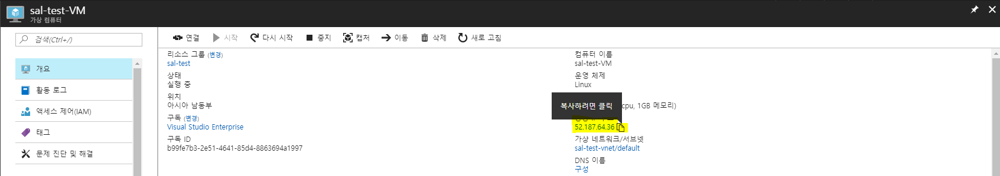
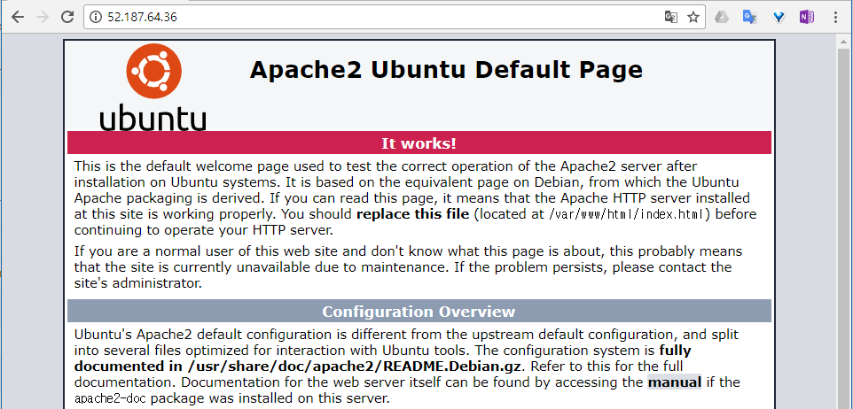
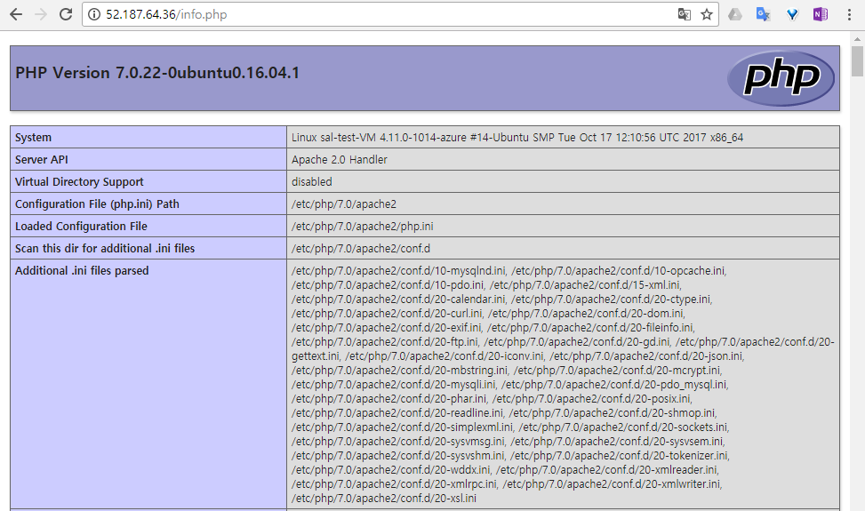
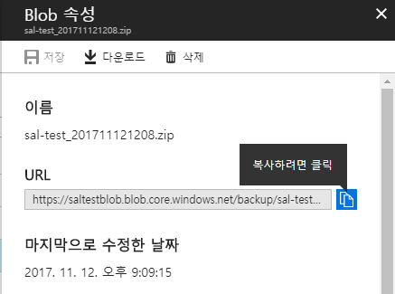
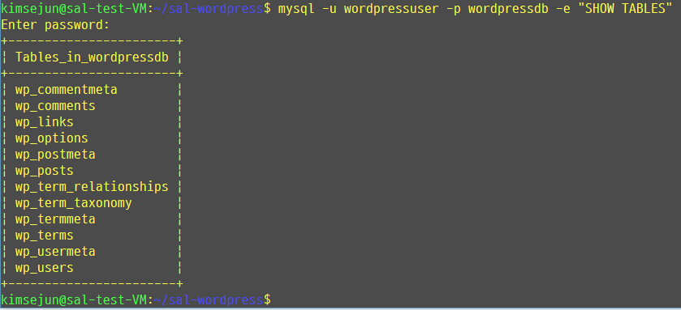
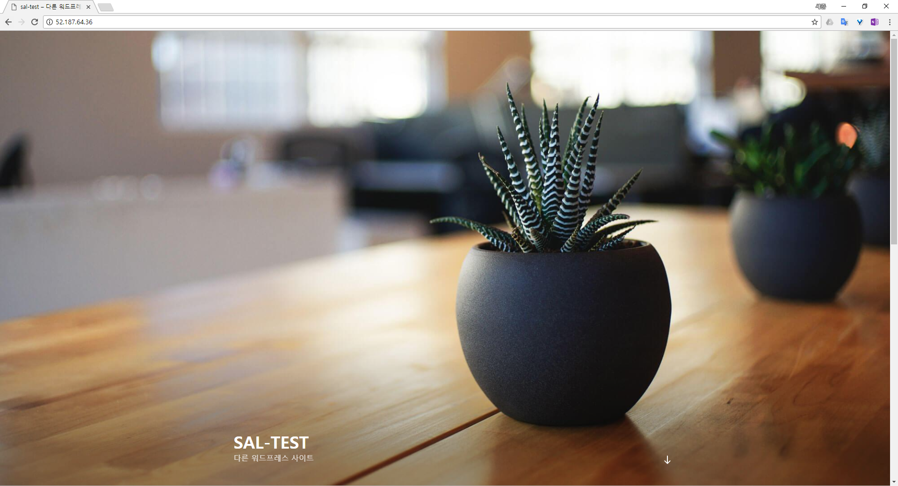

# 1.3 VM에 Wordpress 복구
Azure 웹앱에서 백업한 파일을 가지고 Azure 가상 컴퓨터에 복구하여 봅니다. 이 실습은 반드시 [#1.2 웹앱 백업 구성](https://github.com/krazure/hands-on-lab/blob/master/SAL%201711%20Azure%20%EC%9B%B9%EC%95%B1%EA%B3%BC%20%EB%84%A4%ED%8A%B8%EC%9B%8C%ED%81%AC%20%EB%94%94%EC%9E%90%EC%9D%B8%2C%20%EA%B7%B8%EB%A6%AC%EA%B3%A0%20%EB%A6%AC%EB%88%85%EC%8A%A4/1.2%20%EC%9B%B9%EC%95%B1%20%EB%B0%B1%EC%97%85%20%EA%B5%AC%EC%84%B1.md)을 실습하고 난 다음에 해 주시기 바랍니다.

이번 내용에서는 웹앱에서 백업한 파일을 분석하고, Azure 가상 컴퓨터을 생성하여 Wordpress를 복구합니다. Azure 가상 컴퓨터에 대한 자세한 설명은 [SAL 1704 IaaS 알아보기 - Global Azure BootCamp 2017](https://github.com/krazure/hands-on-lab/tree/master/SAL%201704%20IaaS%20%EC%95%8C%EC%95%84%EB%B3%B4%EA%B8%B0%20-%20Global%20Azure%20BootCamp%202017)를 참고하여 학습하시면 도움이 될 것입니다. Ubuntu 16.04를 생성하여 Wordpress를 설치하기 위한 기본 설정과 함께 파일 업데이트 임계값 조정까지 알아보겠습니다.

## Azure VM 생성
1. [Azure 웹 콘솔](https://portal.azure.com)에 접속합니다.

2. 왼쪽 메뉴에서 **새로 만들기**를 선택합니다.

3. 블레이드에 **새로 만들기**창이 뜨면 오른쪽 **Popular**에서 **Ubuntu Server 16.04 LTS VM**을 클릭합니다.

4. **가상 컴퓨터 만들기**블레이드와 **기본 사항**블레이드가 뜨면 다음과 같이 정보를 입력한 후 아랫쪽에 **확인**버튼을 클릭합니다.
    - `이름` : sal-&lt;ID&gt;-VM
    - `VM 디스크 유형` : 디스크의 성능을 선택합니다. SSD의 경우 프리미엄 디스크를 지칭합니다. 여기서는 **SSD**를 선택합니다.
    - `사용자 이름` : VM에 로그인 할 사용자 이름을 입력합니다.
    - `인증 형식` : 사용자 인증을 SSH 공개 키 형식으로 할지 암호 방식으로 할지를 선택합니다. 여기서는 **SSH 공개 키**를 선택합니다.
    - `SSH 공개 키` : SSH 공개 키를 입력합니다. SSH 공개 키를 만드는 방법은 [0.2 SSH Key 생성](https://github.com/krazure/hands-on-lab/blob/master/SAL%201704%20IaaS%20%EC%95%8C%EC%95%84%EB%B3%B4%EA%B8%B0%20-%20Global%20Azure%20BootCamp%202017/0.2%20SSH%20Key%20%EC%83%9D%EC%84%B1.md)를 참고합니다.
    - `구독` : VM과 관련된 리소스를 생성할 구독을 선택합니다.
    - `리소스 그룹` : **기존 그룹 사용**을 선택하신 후 드롭 다운 메뉴에서 이전에 생성한 리소스 그룹(sal-&lt;ID&gt;)을 선택합니다.
    - `위치` : VM과 관련된 리소스가 생성될 지역을 선택합니다. 여기서는 아시아 남동부를 선택합니다.

5. **크기 선택** 블레이드가 뜨면 아래와 같이 **모두 보기**를 선택한 후 스크롤을 내려 **B1S 표준**을 선택한 후 아랫쪽에 **선택**버튼을 클릭합니다.


6. **설정** 블레이드가 뜨면 다음과 같이 정보를 입력한 후 아랫쪽에 **확인**버튼을 클릭합니다.
    - `가용성 집합` : VM의 가용성 집합을 생성 및 선택합니다. 가용성 집합을 선택할 경우 물리적인 장애에 대비해 격리된 VM을 생성할 수 있습니다. 여기서는 기본 값인 **없음**으로 설정합니다.
    - `관리 디스크 사용` : VM의 디스크를 Blob이 아닌 Azure에서 관리하는 디스크로 생성하는 옵션입니다. 여기서는 **예**를 선택합니다.
    - `OS 디스크 크기` : OS 디스크의 용량 크기를 선택합니다. 여기서는 기본 값인 **기본 크기(30GiB)**을 선택합니다.
    - `가상 네트워크` : VM이 배포 될 가상네트워크를 생성 및 선택합니다. 여기서는 기본 값으로 그대로 둡니다.
    - `서브넷` : VM이 배포 될 서브넷을 선택합니다. 여기서는 기본 값으로 그대로 둡니다.
    - `공용 IP 주소` : VM에 공인 IP를 할당합니다. 여기서는 기본 값으로 그대로 둡니다.
    - `네트워크 보안 그룹(방화벽)` : 네트워크 보안 그룹을 설정합니다. 여기서는 기본 값으로 그대로 둡니다.
    - `확장` : VM에 확장 프로그램을 설치하는 옵션입니다. 여기서는 기본 값인 **확장 없음**으로 설정 합니다.
    - `자동 종료 사용` : VM이 자동으로 종료할 수 있는 옵션입니다. 보통 개발 서버에 설정할 시 VM 이용료를 절약할 수 있습니다. 여기서는 **끄기**를 선택합니다.
    - `부트 진단` : VM이 부팅되는 로그를 설정합니다. 테스트 용도이기 때문에 여기서는 **사용 안 함**을 선택합니다.
    - `게스트 OS 진단` :VM의 OS로그를 설정합니다. 테스트 용도이기 때문에 여기서는 **사용 안 함**을 선택합니다.

7. **요약** 블레이드가 뜨고 **유효성 검사 통과**가 뜨면 **제품 세부 정보**를 한번 확인한 후 아랫쪽에 **만들기**버튼을 클릭합니다.
    > [!메모]
    >
    > `Microsoft나 공급자가 이 제품이나 관련 제품과 관련하여 나에게 연락할 수 있도록, 내 연락처 정보를 사용하고 공유할 수 있는 권한을 Microsoft에 부여합니다.`라는 체크박스는 체크하지 않아도 됩니다.

## Azure VM에 LAMP 스택 구성

8. Azure 가상 컴퓨터이 생성된 후 sal-&lt;ID&gt;-VM 블레이드가 뜨면 **공용 IP 주소**에 있는 IP를 복사한 후 SSH로 접속합니다. **Bash**를 사용하지 못할 경우 [#0.3 Putty client로 Linux 접속하기](https://github.com/krazure/hands-on-lab/blob/master/SAL%201704%20IaaS%20%EC%95%8C%EC%95%84%EB%B3%B4%EA%B8%B0%20-%20Global%20Azure%20BootCamp%202017/0.3%20Putty%20client%EB%A1%9C%20Linux%20%EC%A0%91%EC%86%8D%ED%95%98%EA%B8%B0.md)를 참고하여 접속합니다.


9. 로그인을 한 후 다음 명령어를 사용하여 패키지 업데이트를 한 후 **Apache2**를 설치합니다.
    ```Bash
    $ sudo apt update && sudo apt install -y apache2
    ```
    > [!메모]
    >
    > sudo 명령을 사용하지 않으려면 `sudo su -` 명령어를 사용하여 root 권한으로 접속하여 명령어를 실행합니다.

10. **Apache2** 설치가 완료되면 다음 명령어를 사용하여 **Apache2**를 실행합니다.
    ```Bash
    $ sudo service apache2 start
    ```

11. **Azure 웹 콘솔**로 돌아와 VM의 네트워크 보안 그룹을 수정합니다. sal-&lt;ID&gt;-VM 블레이드의 네비게이터에서 **네트워킹**을 클릭합니다. 찾기 어렵다면 sal-&lt;ID&gt;-VM 블레이드 윗쪽에 검색창에 **네트워킹**을 입력합니다. 오른쪽에 화면이 바뀌면 오른쪽에 **인바운드 포트 규칙 추가**버튼을 클릭한 후 **인바운드 보안 규칙 추가** 블레이드가 뜨면 다음과 같이 정보를 입력한 후 아랫쪽에 **확인**버튼을 클릭합니다.
    - `서비스` : Azure에서 정의된 서비스를 선택하여 정보를 자동으로 입력합니다. 여기서는 **HTTP**를 선택합니다.
    - `포트 범위` : 인바운드 규칙에서 사용할 포트를 설정합니다. `서비스`를 선택했다면 해당 설정은 수정이 불가능합니다.
    - `우선 순위` : 생성할 인바운드 규칙의 우선 순위를 설정합니다. 우선 순위가 낮을 수록 먼저 적용됩니다. 여기서는 기본 값을 그대로 둡니다.
    - `이름` : 표시 될 인바운드 규칙의 이름을 입력합니다. 여기서는 입력된 값을 그대로 둡니다.
    - `설명` : 인바운드 규칙의 설명을 입력합니다. 여기서는 입력하지 않습니다.

12. **보안 규칙 추가**가 완료되면 sal-&lt;ID&gt;-VM 블레이드의 **개요**를 클릭한 후 `8번`에서 복사한 **공용 IP 주소**를 복사하여 새로운 웹 브라우저 주소창에 붙여 넣어 다음과 같이 Apache2 웹페이지가 정상적으로 보이는지 확인합니다.


13. VM에 로그인된 콘솔로 이동합니다. 다음 명령어를 사용하여 **MySQL Server**를 설치합니다. Ubuntu 16.04 LTS에서는 **MySQL Server**를 설치할 때 **root** 암호를 입력하게 되어있으며, 설치되는 버전은 5.7 입니다. **root** 암호를 묻는 창이 뜨면 적절한 암호를 입력한 후 엔터를 입력합니다.
    ```Bash
    $ sudo apt update && sudo apt install -y mysql-server
    ```

14. **MySQL Server**가 설치되면 다음 명령어를 사용하여 **MySQL Server**가 실행중인지 확인합니다.
    ```Bash
    $ sudo service mysql status
    ```
    > [!메모]
    >
    > 만약, **MySQL Server**가 실행되지 않았다면 다음 명령어를 사용하여 **MySQL Server**를 실행합니다..
    > ```Bash
    > $ sudo service mysql start
    > ```

15. **MySQL Server**가 실행중이라면 다음 명령어를 사용하여 **MySQL Server**에 접속합니다.
    ```Bash
    $ mysql -u root -p
    ```

16. **MySQL Server**에 접속하면 다음 MySQL 명령어를 사용하여 `wordpressdb`를 생성합니다. `wordpressdb`를 생성한 후 `wordpressdb`에 접근할 수 있는 `wordpressuser` 계정을 만들고 <사용할 암호>를 설정합니다. 완료된 후 MySQL을 갱신한 후 종료합니다.
    ```MySQL
    mysql> CREATE DATABASE wordpressdb DEFAULT CHARACTER SET utf8 COLLATE utf8_unicode_ci;
    mysql> GRANT ALL ON wordpressdb.* TO 'wordpressuser'@'localhost' IDENTIFIED BY '<사용할 암호>';
    mysql> FLUSH PRIVILEGES;
    mysql> EXIT;
    ```

17. 다음 명령어를 사용하여 **PHP 7.0**을 설치합니다. **PHP 7.0**을 설치할 시 wordpress에서 사용하는 PHP 확장기능도 같이 설치합니다.
    ```Bash
    $ sudo apt update && sudo apt install -y php php php-curl php-gd php-mbstring php-mcrypt php-xml php-xmlrpc libapache2-mod-php php-mysql php-fpm php-json php-cgi
    ```

18. **PHP 7.0** 설치가 완료되면 다음 명령어를 사용하여 **Apache2** 서비스를 재시작 합니다.
    ```Bash
    $ sudo service apache2 restart
    ```
    
    > [!메모]
    >
    > `service apache2 restart` 명령어 대신 다음과 같은 명령어를 사용할 수 있습니다.
    >
    > ```Bash
    > $ sudo systemctl restart apache2
    > ```

19. **PHP 7.0**이 정상적으로 설치되었는지 확인합니다. 다음 명령어를 사용하여 **info.php** 파일을 `/var/www/html` 경로에 생성합니다.
    ```Bash
    $ sudo sh -c 'echo "<?php phpinfo(); ?>" > /var/www/html/info.php'
    ```

20. 새로운 웹 브라우저를 띄우소 Azure 가상 컴퓨터의 공용 IP 주소를 사용하여 다음 주소로 접근했을 시 PHP 정보가 뜨는지 확인합니다.
    - http://<Azure 가상 컴퓨터의 공용 IP 주소>/info.php
    

    > [!메모]
    >
    > 만약 이전 그림과 같은 PHP 정보가 아닌 `<?php phpinfo(); ?>`가 그대로 출력된다면, 다음 명령어를 입력한 후 **Apache2** 서비스를 재시작 한 후에 다시 웹 페이지에 접근을 시도해 봅니다.
    > ```Bash
    > $ sudo a2enmod php7.0
    > $ sudo service apache2 restart
    > ```

## Azure VM에 Wordpress 복구

21. Wordpress 사용을 위해 `.htaccess` Overrides and Rewrites 설정을 합니다. 다음 명령어를 사용하여 `/etc/apache2/apache2.conf` 파일에 내용을 추가합니다.
    
    ```Bash
    $ sudo nano /etc/apache2/apache2.conf
    ```
    > [!메모]
    >
    > 여기서는 텍스트 편집기로 nano를 사용하였습니다. vim 편집기가 편하신 분들은 nano 대신 vim을 사용하시기 바랍니다.

    ```apache2.conf
    ...
    <Directory /var/www/html/>
        AllowOverride All
    </Directory>
    ...
    ```

    ```Bash
    $ sudo a2enmod rewrite
    $ sudo apache2ctl configtest
    $ sudo service apache2 restart
    ```


22. 이제 Azure 웹앱에서 백업한 백업 파일을 확인합니다. sal&lt;ID&gt;blob 블레이드 안에 backup 컨테이너에 접근합니다. 새로운 [Azure 웹 콘솔](https://portal.azure.com)을 띄우고 메뉴에서 **리소스 그룹** -> sla-&lt;ID&gt; -> sal&lt;ID&gt;blob -> Blob -> backup 컨테이너를 차례대로 탐색하여 들어갑니다. backup 컨테이너 블레이드가 뜨면 **액세스 정책**버튼을 클릭합니다. 오른쪽에 **액세스 정책** 블레이드가 뜨면 `공용 액세스 수준`을 `Blob(Blob에 대한 익명 읽기 전용 액세스)`를 선택한 후 윗쪽에 **저장**버튼을 클릭하여 Blob 정책을 업데이트 합니다.

23. backup 컨테이너에서 sal-&lt;ID&gt;_<날짜>.zip 파일(예: sla-test_201711121208.zip)을 클릭합니다. 오른쪽에 **Blob 속성** 블레이드가 뜨면 URL 부분을 복사합니다.


24. 다음 명령어를 사용하여 Azure 웹앱 백업파일을 Azure 가상 컴퓨터에 다운로드 받습니다.
    ```Bash
    $ wget <복사한 URL>
    예) $ wget https://saltestblob.blob.core.windows.net/backup/sal-test_201711121208.zip
    ```

25. 다운로드 받은 .zip 파일의 압축을 풉니다. 다음 명령어를 이용하여 unzip을 설치한 후 다운로드 받은 .zip 파일의 압축을 풉니다.
    ```Bash
    $ sudo apt update && sudo apt install -y unzip
    $ mkdir ./sal-wordpress
    $ unzip sal-<ID>_<날짜>.zip -d ./sal-wordpress
    에) $ unzip sal-test_201711121208.zip -d ./sal-wordpress
    ```

26. `sal-wordpress` 폴더로 이동한 후 폴더 목록을 확인합니다.
    ```Bash
    $ cd ./sal-wordpress
    $ ll
    ```

27. `wordpressdb.sql`를 설치한 MySQL에 복구하도록 하겠습니다. 다음 명령어를 사용하여 생성한 `wordpressdb`에 sql dump 파일을 복구합니다.
    ```Bash
    $ mysql -u wordpressuser -p wordpressdb < wordpressdb.sql
    ```

28. sql dump가 정상적으로 복구되었는지 확인합니다. 
    ```Bash
    $ mysql -u wordpressuser -p wordpressdb -e "SHOW TABLES"
    ```
    

29. Azure 웹앱에서 사용한 Wordpress source를 복구합니다. Apache2의 Home Directory를 바꿔서 사용해도 됩니다만, 여기서는 `/var/www/html` 경로에 복사하는 방식을 사용하겠습니다. 다음 명령어를 차례로 실행하여 Wordpress source를 `/var/www/html`로 복사합니다.
    ```Bash
    $ sudo rm -rf /var/www/html
    $ sudo cp -r ./fs/site/wwwroot /var/www/html
    ```

30. sudo 명령어를 이용했기 때문에 `/var/www/html` 폴더는 root 소유가 되었을 것입니다. 확인은 문제 없으나, 글쓰기 또는 테마 설치, 수정 등 조작이 되지 않기 때문에 폴더 권한을 수정해 주어야 합니다. 다음 명령어들을 입력하여 `/var/www/html`에 적절한 권한을 부여합니다.
    ```Bash
    $ sudo chown -R www-data:www-data /var/www/html
    $ sudo find /var/www/html -type d -exec chmod g+s {} \;
    $ sudo chmod g+w /var/www/html/wp-content
    $ sudo chmod -R g+w /var/www/html/wp-content/themes
    $ sudo chmod -R g+w /var/www/html/wp-content/plugins
    ```

31. `/var/www/html`로 이동한 후 폴더 목록을 확인해 보면 Wordpress가 들어가 있는 것을 확인하실 수 있습니다. 
    ```Bash
    $ cd /var/www/html
    $ ll
    ```

32. 불필요한 폴더를 삭제합니다. 다음 명령어를 이용하여 `upgrade`폴더를 삭제합니다.
    ```Bash
    $ sudo rm -rf /var/www/html/wp-content/upgrade
    ```

33. Azure 웹앱에서는 Database 연결을 시스템변수로 사용했습니다만, VM에서는 직접 수정해 주어야 합니다. 또한 Wordpress는 설치 경로가 변경되었을 때 플러그인 작업 시 경로를 읽지 못하는 문제가 생길 수 있기 때문에 아래와 같은 명령어를 사용하여 `wp-config.php` 파일에 DB연결정보와 경로를 탐색할 수 있는 내용을 입력하고 저장합니다.
    ```Bash
    $ sudo nano wp-config.php
    ```

    ```wp-config.php
    ... # DB 연결정보 변경
    $connectstr_dbhost = '';
    $connectstr_dbname = '';
    $connectstr_dbusername = '';
    $connectstr_dbpassword = '';
    ->
    $connectstr_dbhost = 'localhost';
    $connectstr_dbname = 'wordpressdb';
    $connectstr_dbusername = 'wordpressuser';
    $connectstr_dbpassword = '<암호>';
    ...

    ... # 경로를 탐색오류 수정
    if(is_admin()) {
        add_filter('filesystem_method', create_function('$a', 'return "direct";'));
        define('FS_CHMOD_DIR', 0751);
    }
    ```

34. Azure 가상 컴퓨터의 공용 IP 주소로 접근하면 아래와 같이 Wordpress 페이지가 복구된 것을 확인하실 수 있습니다. 여러가지 기능들이 정상적으로 동작하는지 확인합니다.
    

35. 관리자로 로그인하여 [#1.1 Wordpress on 웹앱+MySQL 만들기](https://github.com/krazure/hands-on-lab/blob/master/SAL%201711%20Azure%20%EC%9B%B9%EC%95%B1%EA%B3%BC%20%EB%84%A4%ED%8A%B8%EC%9B%8C%ED%81%AC%20%EB%94%94%EC%9E%90%EC%9D%B8%2C%20%EA%B7%B8%EB%A6%AC%EA%B3%A0%20%EB%A6%AC%EB%88%85%EC%8A%A4/1.1%20Wordpress%20on%20%EC%9B%B9%EC%95%B1%2BMySQL%20%EB%A7%8C%EB%93%A4%EA%B8%B0.md)에서 설정한 설정이 정상적인지 확인합니다.