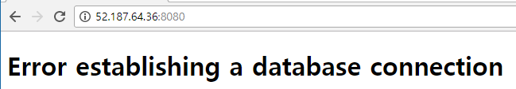

# 1.4 Wordpress Dockerizing(진행중)
Azure VM에 복구한 Wordpress를 컨테이너화 하여 어디든 배포할 수 있도록 구성해 봅니다. 이 실습은 반드시 [#1.3 VM에 Wordpress 복구](https://github.com/krazure/hands-on-lab/blob/master/SAL%201711%20Azure%20%EC%9B%B9%EC%95%B1%EA%B3%BC%20%EB%84%A4%ED%8A%B8%EC%9B%8C%ED%81%AC%20%EB%94%94%EC%9E%90%EC%9D%B8%2C%20%EA%B7%B8%EB%A6%AC%EA%B3%A0%20%EB%A6%AC%EB%88%85%EC%8A%A4/1.4%20Wordpress%20Dockerizing.md)를 실습하고 난 다음에 해 주시기 바랍니다.

이번 내용에서는 Docker에 대한 간단한 실습과 함께 VM에 복구한 Wordpress를 Dockerizing하여 컨테이너 배포를 통해 Docker의 구동 방식에 대해 알아보겠습니다. Docker를 처음 접해보신 분이시거나, 개념만 알고 계신 분들에게 많은 도움이 될 것입니다.

## Docker 구성
1. [#1.3 VM에 Wordpress 복구](https://github.com/krazure/hands-on-lab/blob/master/SAL%201711%20Azure%20%EC%9B%B9%EC%95%B1%EA%B3%BC%20%EB%84%A4%ED%8A%B8%EC%9B%8C%ED%81%AC%20%EB%94%94%EC%9E%90%EC%9D%B8%2C%20%EA%B7%B8%EB%A6%AC%EA%B3%A0%20%EB%A6%AC%EB%88%85%EC%8A%A4/1.4%20Wordpress%20Dockerizing.md)에서 구성한 VM에 SSH로 접속합니다.

2. 다음 명령어를 사용하여 Docker를 설치합니다.
    ```Bash
    $ sudo apt update && sudo apt install -y docker.io
    ```

3. 다음 명령어를 사용하여 Docker 데몬이 정상적으로 실행중인지 확인합니다.
    ```Bash
    $ sudo service docker status
    ```

4. Azure VM을 Ubuntu 16.04로 구성하였으므로, Docker 이미지도 Ubuntu를 사용하겠습니다. 다음 명령어를 사용하여 ubuntu 이미지를 검색합니다.
    ```Bash
    $ sudo docker search ubuntu --no-trunc
    ```
    
    > [!메모]
    >
    > `--no-trunc` 플래그를 사용하면 docker image 설명이 짤리지 않고 출력될 수 있습니다.

5. 다음 명령어를 사용하여 가장 많은 별을 받은 ubuntu 이미지를 가져옵니다. docker build시 사용할 이미지는 ubuntu:16.04 이기에 Tag를 지정해 줍니다.
    ```Bash
    $ sudo docker pull ubuntu:16.04
    ```

6. 다음 명령어를 사용하여 정상적으로 Docker 이미지를 가져왔는지 확인합니다.
    ```Bash
    $ sudo docker images
    ```

## Wordpress Dockerizing

7. Dockerfile을 제작하기 위한 모든 준비가 끝났습니다. 우선 `/var/www` 경로로 이동합니다.
    ```Bash
    $ cd /var/www
    ```

8. `/var/www` 경로에 Dockerfile을 생성합니다.
    ```Dockerfile
    FROM ubuntu:16.04

    RUN apt-get update \
    	&& apt-get install -y --no-install-recommends apache2 php php-curl php-gd php-mbstring php-mcrypt php-xml php-xmlrpc libapache2-mod-php php-mysql php-fpm php-json php-cgi \
    	&& sed -i -e '169a\\<Directory /var/www/html/>' /etc/apache2/apache2.conf \
    	&& sed -i -e '170a\\    AllowOverride All' /etc/apache2/apache2.conf \
    	&& sed -i -e '171a\\</Directory>' /etc/apache2/apache2.conf \
    	&& sed -i -e '172a\\' /etc/apache2/apache2.conf \
    	&& a2enmod rewrite \
    	&& a2enmod php7.0 \
    	&& apache2ctl configtest\
    	&& rm -rf /var/www/html

    COPY ./html /var/www/html

    RUN chown -R www-data:www-data /var/www/html \
	    && chmod -R g+w /var/www/html

    EXPOSE 80

    CMD /usr/sbin/apache2ctl -D FOREGROUND
    ```

9. 다음 명령어를 이용하여 docker build를 합니다. 명령어를 사용할 때 주의할 점은 제일 마지막 `.` 까지 입력이 되어야 합니다.
    ```Bash
    $ sudo docker build -t <Docker 이미지 이름> .
    ```

10. docker build가 성공하였다면 다음 명령어를 이용하여 Docker 이미지를 확인합니다.
    ```Bash
    $ sudo docker images
    ```

11. 다음 명령어를 이용하여 Docker 컨테이너를 배포합니다. 배포시 -p 옵견을 사용하여 Port를 `8080`으로 사용하겠습니다.
    ```Bash
    $ sudo docker run -d -p 8080:80 --name <Docker 컨테이너 이름> <Docker 이미지 이름>
    ```

12. Azure 가상 컴퓨터의 **네트워크 보안 그룹**에 `Port 8080`이 열려있지 않아 설정을 해야 합니다. [Azure 웹 콘솔](https://portal.azure.com)에 접속합니다.

13. 왼쪽 메뉴에서 **리소스 그룹** -> sla-&lt;ID&gt; -> sal&lt;ID&gt;vm 를 차례대로 탐색하여 들어갑니다. sal&lt;ID&gt;vm 블레이드가 뜨면 네비게이터에서 **네트워킹**을 선택합니다. **네트워킹**을 찾기 어렵다면, 윗쪽 검색창에 **네트워킹**을 입력한 후 엔터를 입력합니다.

14. 오른쪽에 **네트워킹** 블레이드가 뜨면 **인바운드 포트 규칙**에서 오른쪽에 **인바운드 포트 규칙 추가**를 클릭한 후 **인바운드 보안 규칙 추가** 블레이드가 뜨면 다음와 같이 입력하고 아랫쪽에 **확인** 버튼을 클릭합니다.
    - `서비스` : Azure에서 미리 정의한 서비스 Port를 선택합니다. 여기서는 `사용자 지정`을 선택합니다.
    - `포트 범위` : 인바운드 보안 규칙에 추가 할 Port 번호를 입력합니다. 여기서는 `8080`을 입력합니다.
    - `우선 순위` : 인바운드 보안 규칙의 순서를 지정합니다. 우선 순위가 낮을 수록 먼저 정책이 적용됩니다. 여기서는 기본으로 생성된 값을 그대로 둡니다.
    - `이름` : 표시 될 인바운드 보안 규칙을 입력합니다.
    - `설명` : 인바운드 보안 규칙에 대한 설명을 입력합니다.

15. **인바운드 포트 규칙 추가**가 완료되면 sal&lt;ID&gt;vm 블레이드의 네비게이터에서 **개요**를 클릭합니다.

16. **개요** 블레이드에서 **공용 IP 주소**를 복사하여 새로운 웹 브라우저에 http://<공용 IP 주소>:8080 으로 접근합니다. 그러면 다음과 같이 데이터베이스 연결 오류가 발생하는 것을 볼 수 있습니다.


## 외부에서 데이터베이스에 접근 가능하도록 설정 수정

17. 데이터베이스 연결 오류가 발생하는 이유는 데이터베이스는 Docker 호스트에 있고, 현재 Wordpress가 실행되고 있는 위치는 Docker 컨테이너이기 때문에 직접 접근을 할 수 없기 때문입니다. 또한, MySQL 설정 시 Localhost에서만 접근이 가능하도록 설정이 되어있습니다. 이를 회피하기 위해 Wordpress의 데이터베이스 서버를 누구든 접근 가능하도록 권한을 수정하고, Azure 가상 컴퓨터의 공용 IP로 지정하겠습니다. 우선 [Azure 웹 콘솔](https://portal.azure.com)에 접속합니다.

18. 앞서 `13번`과 `14번`을 참고하여 **인바운드 보안 규칙 추가** 블레이드에 다음과 같이 입력하고 아랫쪽에 **확인** 버튼을 클릭합니다.
    - `서비스` : Azure에서 미리 정의한 서비스 Port를 선택합니다. 여기서는 `MySQL`을 선택합니다.
    - `포트 범위` : 인바운드 보안 규칙에 추가 할 Port 번호를 입력합니다. `서비스`에서 `MySQL`을 선택했기 때문에 `3306`이 자동으로 입력되며, 수정이 되지 않습니다.
    - `우선 순위` : 인바운드 보안 규칙의 순서를 지정합니다. 우선 순위가 낮을 수록 먼저 정책이 적용됩니다. 여기서는 기본으로 생성된 값을 그대로 둡니다.
    - `이름` : 표시 될 인바운드 보안 규칙을 입력합니다. 여기서는 `MySQL`을 입력합니다.
    - `설명` : 인바운드 보안 규칙에 대한 설명을 입력합니다.

19. **인바운드 포트 규칙 추가**가 완료되면 **인바운드 포트 규칙**에서 방금 생성한 `MySQL` 정책을 클릭합니다. 오른쪽에 `MySQL` 블레이드가 뜨면 아래와 같이 정보를 수정한 후 윗쪽에 **저장**을 클릭하여 **인바운드 포트 규칙**을 수정합니다.
    - `소스` : **네트워크 보안 그룹**이 연결된 리소스에 접근할 수 있는 정책을 정의합니다. **Any**는 누구나 접근 가능하며, **IP Addesses**는 CIDR값으로 접근 가능한 IP 범위를 지정하고, **Service Tag**는 Azure에서 정의한 Tag를 기반으로 접근 허용을 설정할 수 있습니다. 여기서는 **IP Addesses**를 선택합니다.
    - `원본 IP 주소 범위` : **소스**에서 **IP Addresses**를 선택하면 활성화 됩니다. 여기서는 생성한 Azure VM의 **공용 IP 주소**/32를 입력합니다. **공용 IP 주소**는 왼쪽 **네트워크 인터페이스**근처에 **공용 IP**에서 확인하실 수 있습니다.
    - `원본 포트 범위` : **소스**에서 **IP Addresses**를 선택하면 활성화 됩니다. 여기서는 기본 값인 `*`을 그대로 둡니다.
    - `대상 주소` : **인바운드 포트 규칙**을 적용받을 대상을 정의합니다. 일반적으로 **네트워크 보안 그룹**이 연결된 리소스가 기본이며, 여기서는 기본 값인 **Any**를 선택합니다.
    - `대상 포트 범위` : 이전에 설정된 `3306`을 그대로 둡니다.
    - `프로토콜` : 정책의 프로토콜을 지정합니다. 여기서는 **TCP**를 선택합니다.
    - `작업` : 정책의 동작을 선택합니다. 여기서는 **허용**을 선택합니다.
    - `우선 순위` : 정책의 우선순위를 지정합니다. 여기서는 입력되어있는 값을 그대로 둡니다.
    - `이름` : 표시 될 이름입니다. 수정되지 않습니다.
    - `설명` : 인바운드 보안 규칙에 대한 설명을 입력합니다.

20. **보안 규칙**이 업데이트가 완료되면, SSH 콘솔로 되돌아 갑니다.

21. 먼저 Docker 환경을 초기화 합니다. 다음 명령어를 사용하여 실행중인 Docker 컨테이너를 확인합니다.
    ```Bash
    $ sudo docker ps
    ```

22. 출력된 컨테이너 ID를 확인하고 다음 명령어를 사용하여 실행중인 Docker 컨테이너를 종료합니다.
    ```Bash
    $ sudo docker rm -f <컨테이너 ID>
    ```

23. 다음 명령어를 사용하여 실행중인 Docker 컨테이너가 더 이상 없는지 확인합니다.
    ```Bash
    $ sudo docker ps -a
    ```

    > [!메모]
    >
    > `-a` 옵션을 사용하면 비정상적으로 동작한 컨테이너도 함께 확인할 수 있습니다.

24. 다음 명령어를 사용하여 기존에 Docker build로 생성한 Docker 이미지를 삭제합니다.
    ```Bash
    $ sudo docker rmi <Docker 이미지 이름>
    ```

25. 다음 명령어를 사용하여 MySQL 서버 설정을 확인합니다.
    ```Bash
    $ netstat -an | grep 3306
    ```

26. 결과로 `127.0.0.1:3306`을 확인할 수 있습니다. 다음 명령어를 사용하여 **mysql.cnf** 파일을 수정합니다.
    ```Bash
    $ sudo nano /etc/mysql/mysql.conf.d/mysqld.cnf
    ```

    ```mysqld.cnf
    bind-address            = 127.0.0.1
    ->
    bind-address            = 0.0.0.0
    ```

27. 다음 명령어를 차례대로 사용하여 MySQL 서비스를 재시작한 후 MySQL 서비스가 `0.0.0.0:3306`으로 되어있는지 확인합니다.
    ```Bash
    $ sudo nano /etc/mysql/mysql.conf.d/mysqld.cnf
    $ netstat -an | grep 3306
    ```

28. 다음은 MySQL에 접속하여 **wordpressuser** 계정을 어디서든 접근 가능하도록 수정해야 합니다. 다음 명령어를 사용하여 MySQL에 접속한 후 **wordpressuser**를 수정합니다.
    ```Bash
    $ mysql -u root -p
    ```

    ```MySQL
    mysql> GRANT ALL ON wordpressdb.* TO 'wordpressuser'@'%' IDENTIFIED BY '<암호>';
    mysql> FLUSH PRIVILEGES;
    mysql> exit;
    ```

29. 다음 명령어를 사용하여 Wordpress의 Database 연결 설정을 수정합니다.
    ```Bash
    $ sudo nano /var/www/html/wp-config.php
    ```

    ```wp-config.php
    $connectstr_dbhost = 'localhost';
    ->
    $connectstr_dbhost = '<공용 IP 주소>';
    ```

30. 새로운 웹 브라우저를 실행한 후 Azure 가상 컴퓨터의 **공용 IP 주소**로 접근하여 Wordpress가 정상적으로 접속되는지 확인합니다.

## Wordpress를 다시 dockerizing 하기

31. 다음 명령어를 이용하여 docker build를 한 후 Port 8080으로 Wordpress 컨테이너를 실행합니다.
    ```Bash
    $ cd /var/www
    $ sudo docker build -t <Docker 이미지 이름> .
    $ sudo docker run -d -p 8080:80 --name <Docker 컨테이너 이름> <Docker 이미지 이름>
    ```

32. 새로운 웹 브라우저를 실행한 후 `http://<공용 IP 주소>:8080` 으로 접근시 Wordpress가 정상적으로 접속되는지 확인합니다.