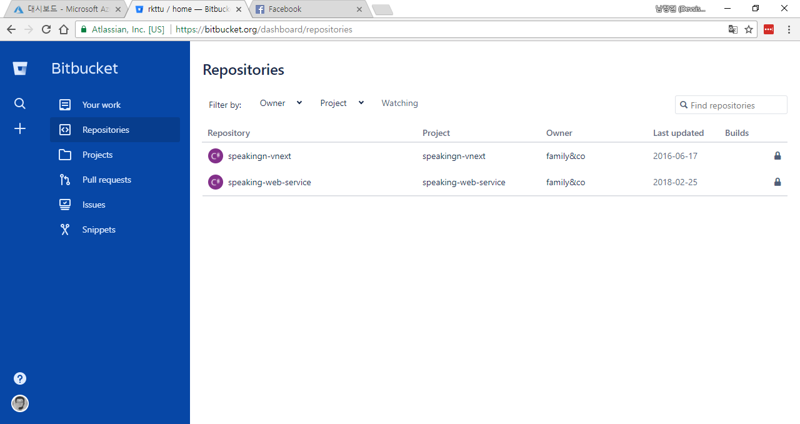
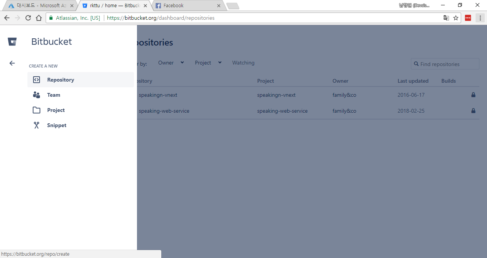
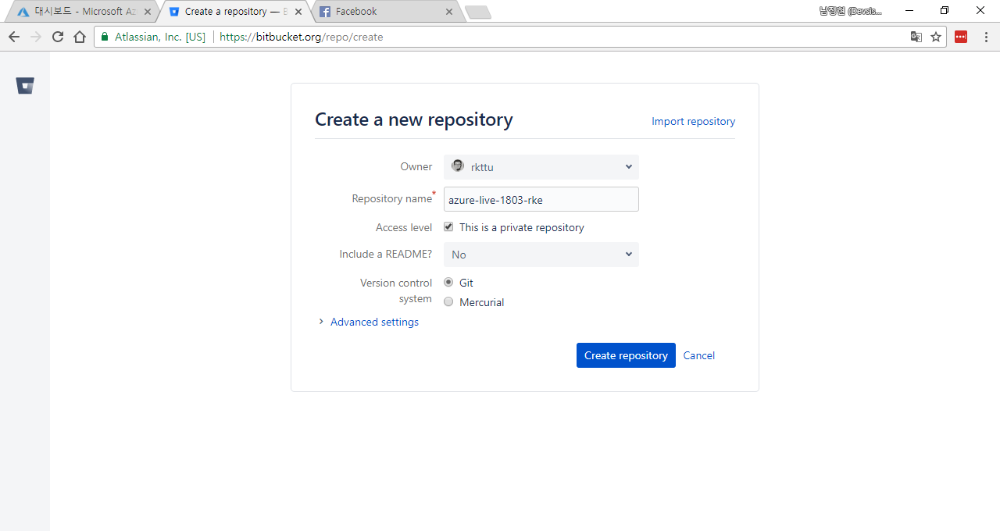
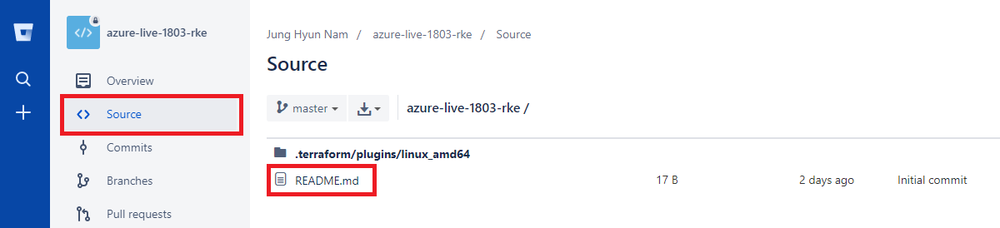
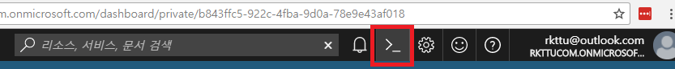
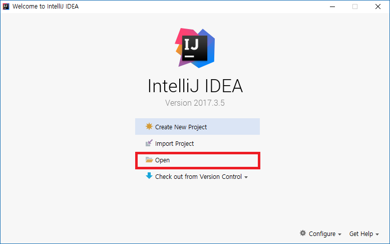
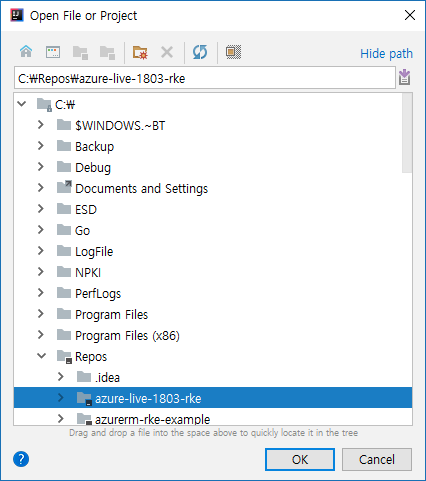
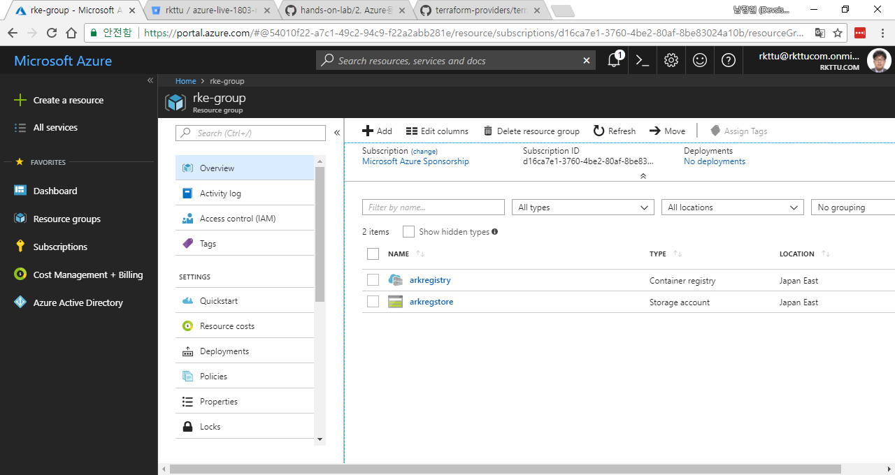

# 2. Azure용 Terraform 사용해보기

이제 Terraform의 기본 사용법을 익혀보도록 하겠습니다.

## 2.1. Terraform 기본 컨셉 살펴보기

Terraform의 문법은 `Hashicorp Configuration Language` 라는 언어의 규격을 따르도록 설계되어있으며, 확장자가 `.tf`인 파일을 여러개 모아놓은 디렉터리를 하나의 프로젝트처럼 취급합니다. 그 중에서, `main.tf` 라는 파일이 시작 위치이며, 이 파일을 중심으로 모든 처리가 이루어집니다.

Terraform이 지원하는 확장 기능들은 `Provider` 라고 지칭하며, 그 중에서 이번 Hands-on-Lab에서는 `Azure Resource Manager Provider`를 위주로 사용합니다.

**NOTE** Azure Resource Manager 기반의 시스템이 만들어지기 이전에 개발된 `Azure Provider`도 있었습니다. 그러나 더 이상 사용되지 않습니다. Provider 이름을 기재할 때 실수하기 쉬우므로 코드에 등장하는 Provider 이름을 숙지하여 주십시오.

Terraform은 원격에 배포한 리소스들의 상태도 State라는 파일 저장소에 같이 보관하며, 배포가 이루어질 때마다 파일 저장소에 실제 리소스들의 마지막 상태를 기록합니다. `Plan` -> `Apply` 의 절차를 거치며, State라는 파일 저장소를 영구적으로 보관할 수 있으면 Azure CLI나 Azure Resource Manager 스크립트를 매번 새로 만들지 않고 손쉽게 인프라를 관리할 수 있습니다.

## 2.2. Terraform 배포 전략 세우기

로컬에서 Terraform 스크립트를 작성하여, Azure Cloud Shell을 이용하여 Terraform을 프로비져닝하고 Post Install을 간편하게 수행할 수 있도록 전략을 세울 것입니다. 이 모듈에서는 다음의 구성 요소들을 Azure 상에 구축할 것입니다.

- 공개되지 않는 사설 Git 저장소 생성 (GitHub Enterprise, BitBucket, Visual Studio Team Service 등 원하는 저장소를 선택하실 수 있습니다. 여기서는 무료로 쉽게 만들어 사용할 수 있는 BitBucket을 기준으로 설명합니다.)
- 작업 전반에 걸쳐 사용할 Private/Public SSH 키 페어 생성 (PuTTYgen 유틸리티 사용)
- Azure Cloud Shell 환경 설정하기

## 2.3. 사설 Git 저장소 만들기

Terraform 파일들을 로컬 에디터 및 Cloud Shell 환경과 공유하면서 작업하기 편하도록 환경을 구축해야 합니다. GitHub Enterprise나 Bitbucket, Visual Studio Team Service 등의 사설 Git 저장소를 사용할 수 있습니다. 이 실습 모듈에서는 BitBucket을 기준으로 설명을 진행하겠습니다.

2.3.1. [BitBucket](https://www.bitbucket.org) 에 무료로 회원 가입을 합니다.

2.3.2. BitBucket으로 로그인하면 아래와 같이 리포지터리 목록을 조회하는 화면이 나타나게 됩니다. 화면 좌측에 '+' 버튼을 누릅니다.



2.3.3. 새로 나타나는 메뉴에서 `Repository` 메뉴를 클릭합니다.



2.3.4. `Access Level` 은 `Private Repository`를 나타내도록 선택하고, 버전 관리 시스템은 `Git`을 선택합니다. 실습의 내용을 따르지 않고 편의에 따라 `Mercurial`을 대신 선택해도 무방하지만, 여기서는 `Git`을 기준으로 설명하겟습니다.



2.3.5. 새 리포지터리가 만들어지면 사용 방법을 설명하는 가이드가 나옵니다. 링크 하단의 체크아웃 방법을 참고하여 실제 로컬 디렉터리에 체크아웃해보도록 하겠습니다.


2.3.6. 처음 git을 설치한 경우 원격 리포지터리에 사용할 커밋한 사람에 대한 개인 정보를 지정해야만 합니다. `사용자이름`과 `메일주소` 부분을 여러분이 실제로 사용하는 정보로 치환하여 공백 없이 입력합니다.

```sh
git config --global user.name 사용자이름
git config --global user.email 메일주소
```

2.3.7. 선호하는 명령 프롬프트 창을 열고, 앞 단계에서 만든 git 리포지터리를 체크아웃해보겠습니다.

```batch
git clone https://your_bitbucket_id@bitbucket.org/your_bit_bucket_id/azure-live-1803-rke.git
cd azure-live-1803-rke
```

2.3.8. 처음 리포지터리를 체크아웃하였고, 리포지터리에 파일을 제대로 추가할 수 있는지를 테스트해보기 위하여 `README.md` 파일을 새로 만들거나, 파일이 이미 있으면 텍스트 에디터로 열어 임의의 내용을 추가하고 저장합니다.

2.3.9. 다음 명령을 입력하여 Git 커밋 대상에 포함시킵니다.

```sh
git add README.md
```

2.3.10. 다음 명령을 입력하여 `Initial Commit` 이라는 메시지를 포함하는 새로운 커밋을 로컬 리포지터리에 추가합니다.

```sh
git commit -m "Initial commit"
```

2.3.11. 다음 명령을 입력하여 BitBucket 리포지터리와 커밋을 동기화합니다.

```sh
git push origin
```

2.3.12. 작업이 완료되면 BitBucket 온라인 리포지터리에도 파일이 변경되거나 추가된 것이 잘 들어있는지 확인합니다. 아래 그림과 같이 리포지터리 파일 목록 상에 `README.md` 파일이 보이면 됩니다.



## 2.4. Cloud Shell에 체크아웃하기

2.4.1. 리포지터리의 주소를 확인한 다음, 로컬 컴퓨터와 `Cloud Shell`의 `~/clouddrive` 디렉터리에 리포지터리를 각각 체크아웃합니다. 이 Hand on Lab 가이드에서는 편의를 위하여 `master` 브랜치로만 작업을 진행할 것입니다.

2.4.2. 작업의 편의를 위하여 `https://portal.azure.com` 웹 사이트에 로그인하여 포털을 브라우저에 띄우고, 화면 상단 우측의 Cloud Shell 아이콘을 클릭하여 창을 띄웁니다. (아래 그림 참고)



**TIP** 만약 Cloud Shell을 동시에 여러개를 띄워서 작업하고 싶다면 `https://shell.azure.com` 웹 사이트를 여러번 사용하실 수 있습니다. 단, 가용 리소스에 제약이 있을 수 있으므로 복잡하거나 오래 걸리는 작업이 필요한 경우에는 별도의 리눅스 가상 컴퓨터를 생성하여 사용하는 것이 더 나을 수 있습니다.

**TIP** 포털 내의 Cloud Shell을 이용하면서 콘솔 창을 종료하는 것이 아니라 잠시 감추고 싶다면 최소화 버튼을 클릭하십시오. 일반 Win32 응용프로그램을 사용할 때 누르는 최소화 버튼과 의미가 같습니다.

**TIP** 세션에 아무런 상호작용이 없는 경우 30분간 유휴 상태가 유지되다가 자동으로 종료됩니다. 단, 이 모듈에서처럼 사용자가 전개한 오래 걸리는 배치 작업이 있을 경우 지속적으로 tty에 출력이 발생하므로 이 때에는 유휴 시간에 포함되지 않습니다.

2.4.3. Cloud Shell을 처음 만들면, PowerShell과 Bash 중 어떤 것을 택할지 별도로 물어보는 대화 상자가 나타납니다. 이 때 Bash 셸을 사용하도록 선택합니다. 이 모듈에서 사용하는 모든 도구는 Win32용 어플리케이션이 제공되지만, 실습의 편의를 위하여 Bash 셸을 사용하는 것을 기준으로 설명할 것입니다.

2.4.4. 사용자 홈 디렉터리의 `clouddrive` 디렉터리는 Cloud Shell 생성과 동시에 초기화되는 별도의 Azure Storage의 File Storage에 마운트되어있고, 여기에 파일을 저장하면 Cloud Shell을 어떤 방식으로 띄우든 무관하게 마지막으로 저장한 내용이 그대로 유지됩니다. 이 디렉터리를 적극 활용할 것입니다.

2.4.5. 이제 다음과 같이 Cloud Shell 내에서 명령을 입력하겠습니다.

```sh
cd ~/clouddrive
git clone https://your_bitbucket_id@bitbucket.org/your_bit_bucket_id/azure-live-1803-rke.git
cd azure-live-1803-rke
```

2.4.6. 다음 명령을 입력하여 `README.md` 파일이 표시되는지 확인합니다.

```sh
ls
```

## 2.5. Terraform 스크립트 작성

Terraform 스크립트를 작성하여 Git 저장소에 Push하고, Cloud Shell에서 Pull 하는 과정을 거치도록 하겠습니다.

2.5.1. IntelliJ Community Edition을 실행하고, 아래 그림과 같이 `Open` 버튼을 클릭합니다. 만약 아래 그림 대신 기존 프로젝트가 열리는 경우, 상단 메뉴에서 `File` - `Open` 메뉴를 클릭합니다.



2.5.2. 앞 단계에서 체크아웃한 리포지터리 디렉터리를 찾아 선택하고, `OK` 버튼을 클릭합니다.



2.5.3. 다음과 같이 `main.tf` 파일을 작성합니다.

코드 상에 등장하는 모든 `rkttu`라는 문구는 임의의 5글자 이내의 고유한 영어 소문자로 변경하여 주시기 바랍니다.

```hcl
# 변수 선언
variable arm-prefix {
    default = "rkttu-rke"
}

# 리소스 그룹
resource "azurerm_resource_group" "rke-group" {
    name = "${var.arm-prefix}-group"
    location = "japaneast"
}
```

2.5.4. 그리고 작업의 편의를 위하여 `.gitignore` 파일을 작성합니다.

```text
# Compiled files
*.tfstate
*.tfstate.backup

# Module directory
.terraform/

# IDEA related directory
.idea/

# cluster.yml file (Output)
cluster.yml

# rke binary file
rke_linux-amd64

# PEM, PUB file
*.pem
*.pub
```

2.5.5. 명령 프롬프트로 로컬에 체크아웃한 디렉터리를 엽니다.

2.5.6. 다음 명령을 입력하여 작업 중인 파일들을 모두 추가합니다.

```sh
git add .
```

2.5.7. 다음 명령을 입력하여 새로운 커밋을 생성합니다.

```sh
git commit -m "Add terraform main module"
```

2.5.8. 다음 명령을 입력하여 원격 저장소와 내용을 동기화합니다.

```sh
git push origin
```

2.5.9. Cloud Shell에 로그인하고, `~/clouddrive` 디렉터리 내에 체크아웃 받은 디렉터리로 이동합니다.

2.5.10. 다음 명령을 입력하여 원격 저장소의 내용을 동기화합니다.

```sh
git pull origin
```

2.5.11. 다음 명령을 입력하여 Terraform 스크립트 실행을 위한 환경을 자동으로 설정하게 합니다.

```sh
terraform init
```

2.5.12. 다음 명령을 입력하여 어떤 내용들이 반영될 것인지를 미리 확인해봅니다.

```sh
terraform plan
```

2.5.13. 다음 명령을 입력하여 실제로 Azure Resource Manager가 작업을 처리하게 예약합니다. 명령 입력 후 `yes` 를 입력하여 변경에 동의함을 확인합니다.

```sh
terraform apply
```

2.5.14. 작업이 오류 없이 완료될 때까지 기다린 후, 포털의 리소스 그룹에 Terraform 스크립트에서 만들도록 요청한 새로운 리소스 그룹이 잘 만들어졌는지 확인해봅니다.

## 2.6. Terraform State 체험해보기

Terraform을 선택하는 이유는 스크립트 자체의 버전 관리가 가능하다는 점 이외에도, 실제 인프라와의 상태를 동기화하여 정보를 가지고 있는 Terraform State를 이용하여 인프라 프로비져닝 작업에 걸리는 시간을 줄이고, 효율적으로 작업할 수 있기 때문입니다.

이 Hands-on-Lab에서는 `~/clouddrive` 디렉터리에 로컬 Terraform State 파일을 보관하도록 하여 간편하게 상태를 보존하는 방식으로 설명을 진행합니다. 필요한 경우 [Azure Terraform 가이드 문서](https://www.terraform.io/docs/backends/types/azurerm.html) 를 대신 활용할 수도 있습니다.

Terraform State가 잘 작동하는지 확인하기 위하여 Azure Container Registry 리소스를 추가해보겠습니다.

2.6.1. 로컬에서 main.tf 파일의 하단부에 다음의 스크립트 블록을 추가합니다. 같은 내용이 반복되지 않았는지 점검하여 내용을 추가하도록 합니다. 코드 상에 등장하는 모든 `rkttu`라는 문구는 임의의 5글자 이내의 고유한 영어 소문자로 변경하여 주시기 바랍니다.

```hcl
resource "azurerm_storage_account" "arkregstore" {
    name = "rkttustore"
    location = "japaneast"
    resource_group_name = "${azurerm_resource_group.rke-group.name}"
    account_replication_type = "LRS"
    account_tier = "Standard"
}

resource "azurerm_container_registry" "arkregistry" {
    name = "rkttureg"
    location = "japaneast"
    resource_group_name = "${azurerm_resource_group.rke-group.name}"
    storage_account_id = "${azurerm_storage_account.arkregstore.id}"
}
```

2.6.2. 파일의 내용을 수정한 다음, 다음 명령으로 내용을 커밋하고 원격 저장소와 커밋을 동기화합니다.

```sh
git add .
git commit -m "Add container registry definition"
git push origin
```

2.6.3. 다음 명령으로 내용을 받아옵니다.

```sh
git pull origin
```

2.6.4. 다음 명령을 실행하여 플러그인을 다운로드하고, 실행 환경을 구축합니다.

```sh
terraform init
```

**TIP** Azure Cloud Shell과 함께 제공되는 Terraform을 이용하면 Azure Resource Manager 인증 정보를 별도로 제공하지 않고, 안전하고 간편하게 Terraform을 Azure Resource Manager에 연동할 수 있습니다.

2.6.5. 다음 명령을 실행하여, 리소스 그룹 외에 Azure Storage Account와 Azure Container Registry가 생성될 예정이라는 메시지가 정확히 표시되는지 확인합니다.

```sh
terraform plan
```

**TIP** 만약 자동으로 인증되지 않고 Subscription ID와 Tenant ID를 입력해야 한다는 오류 메시지가 보이면 `provider` 리소스 블록에 `subscription_id`와 `tenant_id` 프로퍼티에 값을 추가합니다. 여기에 지정할 값을 확인하려면 `az account show` 명령을 이용하면 됩니다.

2.6.6. 다음 명령을 실행하고, 결과가 잘 반영되었는지 확인합니다. 실행 확인을 위하여 `yes`를 입력하고 기다립니다.

```sh
terraform apply
```

2.6.7. 아래 그림과 같이 포털에 표시가 잘 되면 성공한 것입니다.



2.6.8. 다음 명령을 실행하여 지금까지 만든 내용을 인프라에서 할당 해제합니다. 실행 확인을 위하여 `yes`를 입력하고 기다립니다. 모두 처리가 완료된 후, 포털에서도 리소스 해제가 잘 되었는지 확인해봅니다.

```sh
terraform destroy
```

**TIP** 만약 Terraform에서 작업에 실패했다고 표시되는 경우, Terraform이 배포한 다음 수작업으로 Azure 리소스에 대한 변경이 일어난 부분이 있어서 발생하는 것일 수 있습니다. 실제 운영 환경에서는 있어서는 안되는 일이며, 이 모듈 상에서는 해당 리소스 그룹을 포털이나 Azure CLI에서 직접 삭제 요청하는 것으로 문제를 해결할 수 있습니다.

이와 같은 방식으로 워크플로를 만들어 인프라 관리를 효율적으로 진행할 수 있습니다.

이제 실제로 Rancher를 이용하여 Kubernetes 클러스터를 클라우드 상에 구축해보도록 하겠습니다.
