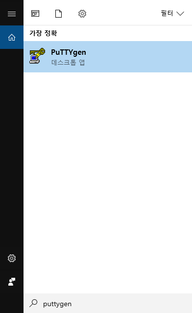
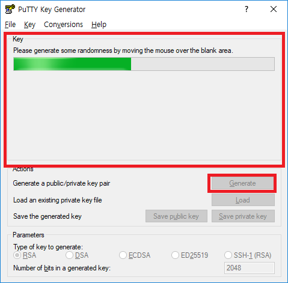
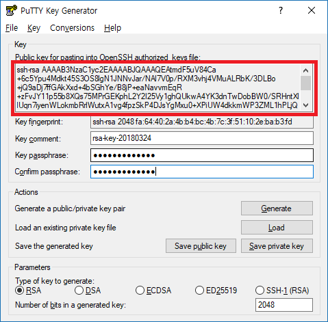
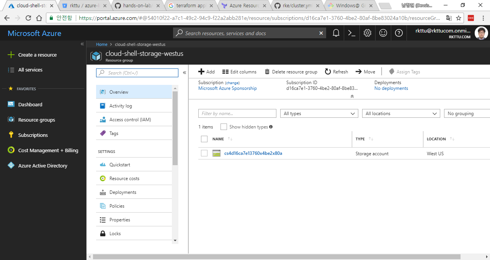
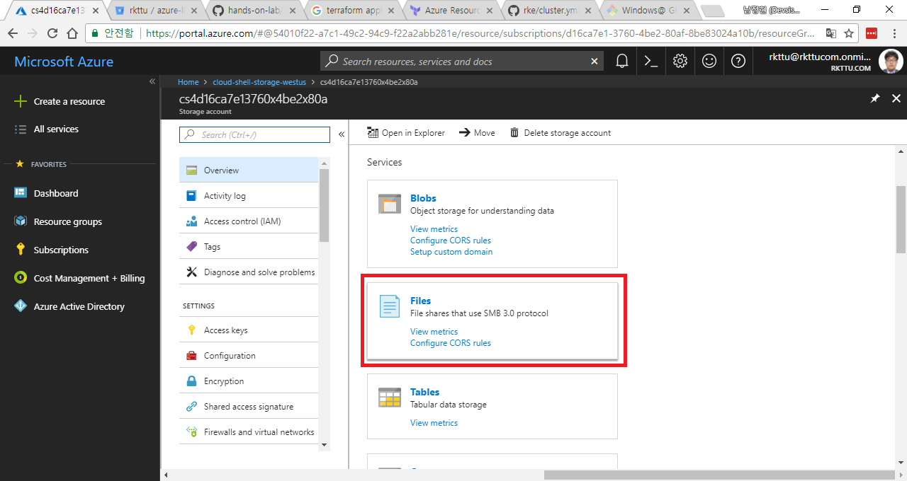
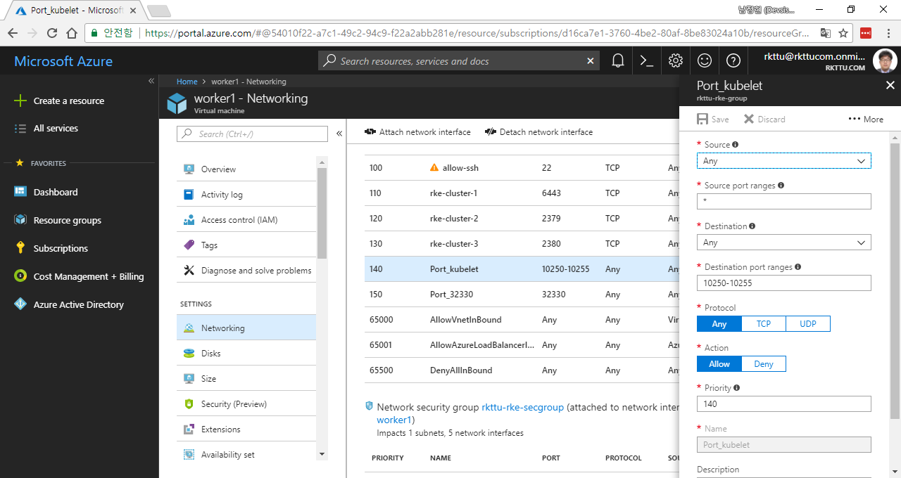

# 3. Rancher 클러스터 구축

이제 가장 길고 중요한 과정을 진행하는 단계에 접어들었습니다.

## 3.1. Rancher에 전달할 키 파일을 생성하고 업로드하기

Rancher는 SSH를 이용하여 서버들의 구성을 변경하도록 되어있습니다. 그리고 SSH 접속 시 아이디와 비밀 번호를 넣는 것이 아니라 SSH 비밀 키를 사용하여 인증을 하게 됩니다. 따라서 Azure Resource Manager로 가상 컴퓨터를 생성할 당시에 지정하는 비밀 키를 Rancher에도 지정해야 하므로, 작업자 컴퓨터에서 Key Pair를 만들어 전달하는 것이 유용합니다.

Key Pair를 만들기 위하여 다음의 과정을 진행합니다.

3.1.1. PuTTYgen 유틸리티를 실행합니다.



3.1.2. PuTTYgen을 실행한 다음, Generate 버튼을 클릭합니다. 그리고, 아래의 사각형 영역 안에서 포인터를 이리저리 휘젓습니다. 규칙성이 없는 난수 값 생성을 위한 입력 소스로 사용되기 때문에 필요한 동작입니다.



3.1.3. 키를 만든 다음에는 `Key passphrase` 필드에 키에 대한 비밀 번호를 입력하고, `Confirm passphrase` 필드에 한 번 더 같은 비밀 번호를 입력합니다.

3.1.4. 키 생성 방식은 `RSA`를 사용합니다. 만약 `RSA`가 보이지 않으면 `SSH-2 RSA`를 선택합니다.

3.1.5. 필요한 필드를 모두 채운 다음, `Save private key` 버튼을 클릭하여 PPK 파일을 저장합니다. PPK 파일은 PuTTY 프로그램에서 사용하는 독자적인 Public Key / Private Key 포함 파일이며, 필요할 때에는 언제든지 나중에 다시 사용할 수 있도록 하기 위하여 뱐드시 저장해야 합니다.

3.1.6. `.ppk` 파일 외에 키 파일을 리눅스 환경에서 사용할 수 있도록 `.pem` 파일로 변환하여 저장해야 합니다. `PuTTYgen` 상단의 `Conversions` 메뉴에서 `Export OpenSSH Key` 메뉴를 클릭합니다.

3.1.7. 파일 저장 대화 상자에서 파일 이름란에 `"privatekey.pem"` 이라고 입력합니다. 파일 이름은 적절하게 바꾸시되, 반드시 양 옆에 따옴표를 붙이고, 파일 확장자는 `.pem` 이 되도록 저장합니다.

3.1.8. 아래 그림에서 빨간색 사각형으로 강조한 텍스트 박스의 모든 텍스트를 복사한 후, 별도의 텍스트 에디터에 붙여넣은 다음, 파일 확장자가 `.pub`이 되도록 같은 방법으로 저장합니다.



3.1.9. 만들어진 PEM 파일을 Azure Cloud Shell과 연결된 저장소에 업로드합니다. 포털에 접속하여 아래 그림과 같이 Cloud Shell 관련 리소스 그룹을 찾아 엽니다.



3.1.10. Files 버튼을 아래 화면과 같이 찾아서 누른 다음, PEM 파일과 PUB 파일을 웹 상에서 업로드합니다. 업로드할 때에는 앞 단계에서 체크아웃한 Git 리포지터리 디렉터리 안에 받아두면 작업이 쉽습니다.



3.1.11. 업로드가 완료된 후 Cloud Shell에서 체크아웃을 받아두었던 Git 리포지터리 안에 pem 파일과 pub 파일이 제대로 들어있는지 확인합니다.

## 3.2. 스크립트 파일 작성하기

아래의 스크립트의 내용을 하나씩 입력하면서 진행할 것입니다. 창 분할 기능을 이용하여 브라우저와 JetBrains IDE를 좌우로 띄워놓고 실습을 진행하도록 하겠습니다. Terraform 플러그인의 기능을 활용하여 잘못 타이핑하거나 오류가 있는 내용은 교정하면서 진행할 수 있습니다.

단, 파일들 중 `output.tf` 파일은 복사하여 붙여넣어 주십시오. `cluster.yml` 파일을 정확하게 만들기 위한 도우미 코드이므로, 실수를 최소화하는 것이 실습에 유용합니다.

코드 상에 등장하는 모든 `rkttu`라는 문구는 임의의 5글자 이내의 고유한 영어 소문자로 변경하여 주시기 바랍니다.

### main.tf 파일

```hcl
provider "azurerm" {
  # 만약 자동으로 인증되지 않을 경우 아래 프로퍼티에 값을 추가하고 주석을 해제합니다.
  # subscription_id = ""
  # tenant_id = ""
}

variable arm-prefix {
  default = "rkttu-rke"
}

variable dns-prefix {
  default = "rktturke"
}

variable vm-names {
  type = "list"
  default = [
    "controlplane",
    "etcd",
    "worker1",
    "worker2",
    "worker3"
  ]
}

variable vm-roles {
  type = "list"
  default = [
    "controlplane",
    "etcd",
    "worker",
    "worker",
    "worker"
  ]
}

variable vm-admin-username {
  default = "rkttu"
}

variable vm-ssh-public-key-path {
  type = "string"
}

data "template_file" "docker-deploy-script" {
  template = "${file("docker-deploy-script.tpl")}"
  vars {
    vm_admin_username = "${var.vm-admin-username}"
  }
}

# *********************** RKE CLUSTER *********************** #
resource "azurerm_resource_group" "rke-group" {
  name = "${var.arm-prefix}-group"
  location = "japaneast"
}

resource "random_id" "randomizer" {
  keepers = {
    # Generate a new ID only when a new resource group is defined
    resource_group = "${azurerm_resource_group.rke-group.name}"
  }
  byte_length = 8
}

# ********************** VNET / SUBNET ********************** #
resource "azurerm_virtual_network" "rke-vnet" {
  name = "${var.arm-prefix}-vnet"
  resource_group_name = "${azurerm_resource_group.rke-group.name}"
  location = "${azurerm_resource_group.rke-group.location}"
  address_space = ["10.0.0.0/16"]
}

resource "azurerm_subnet" "rke-subnet" {
  name = "${var.arm-prefix}-subnet"
  virtual_network_name = "${azurerm_virtual_network.rke-vnet.name}"
  resource_group_name = "${azurerm_resource_group.rke-group.name}"
  network_security_group_id = "${azurerm_network_security_group.rke-secgroup.id}"
  address_prefix = "10.0.1.0/24"
  depends_on = ["azurerm_virtual_network.rke-vnet"]
}

# **********************  STORAGE ACCOUNTS ********************** #
resource "azurerm_storage_account" "rke-storage" {
  name = "stor${random_id.randomizer.hex}"
  resource_group_name = "${azurerm_resource_group.rke-group.name}"
  location = "${azurerm_resource_group.rke-group.location}"
  account_tier = "Standard"
  account_replication_type = "LRS"
}

# **********************  NETWORK SECURITY GROUP ********************** #
resource "azurerm_network_security_group" "rke-secgroup" {
  name = "${var.arm-prefix}-secgroup"
  resource_group_name = "${azurerm_resource_group.rke-group.name}"
  location = "${azurerm_resource_group.rke-group.location}"

  security_rule {
    name = "allow-ssh"
    description = "Secure Shell"
    priority = 100
    direction = "Inbound"
    access = "Allow"
    protocol = "Tcp"
    source_port_range = "*"
    destination_port_range = "22"
    source_address_prefix = "*"
    destination_address_prefix = "*"
  }

  security_rule {
    name = "rke-cluster-1"
    description = "Kubernetes Communication Port 1"
    priority = 110
    direction = "Inbound"
    access = "Allow"
    protocol = "Tcp"
    source_port_range = "*"
    destination_port_range = "6443"
    source_address_prefix = "*"
    destination_address_prefix = "*"
  }

  security_rule {
    name = "rke-cluster-2"
    description = "Kubernetes Communication Port 2"
    priority = 120
    direction = "Inbound"
    access = "Allow"
    protocol = "Tcp"
    source_port_range = "*"
    destination_port_range = "2379"
    source_address_prefix = "*"
    destination_address_prefix = "*"
  }

  security_rule {
    name = "rke-cluster-3"
    description = "Kubernetes Communication Port 3"
    priority = 130
    direction = "Inbound"
    access = "Allow"
    protocol = "Tcp"
    source_port_range = "*"
    destination_port_range = "2380"
    source_address_prefix = "*"
    destination_address_prefix = "*"
  }
}

# **********************  PUBLIC IP ADDRESSES ********************** #
resource "azurerm_public_ip" "rke-public-ip" {
  name = "${var.arm-prefix}-public-ip"
  location = "${azurerm_resource_group.rke-group.location}"
  resource_group_name = "${azurerm_resource_group.rke-group.name}"
  public_ip_address_allocation = "Static"
  domain_name_label = "${var.dns-prefix}"
}

resource "azurerm_public_ip" "rke-face-ip" {
  name = "${var.arm-prefix}-${element(var.vm-names, count.index)}-ip"
  count = "${length(var.vm-names)}"
  location = "${azurerm_resource_group.rke-group.location}"
  resource_group_name = "${azurerm_resource_group.rke-group.name}"
  public_ip_address_allocation = "Static"
  domain_name_label = "${var.dns-prefix}-${element(var.vm-names, count.index)}"
}

# **********************  AVAILABILITY SET ********************** #
resource "azurerm_availability_set" "rke-availability-set" {
  name = "${var.arm-prefix}-set"
  location = "${azurerm_resource_group.rke-group.location}"
  resource_group_name = "${azurerm_resource_group.rke-group.name}"
  managed = true

  # region 별로 지정 가능한 fault domain의 숫자가 다릅니다. 아래 리소스를 참조하세요.
  # https://github.com/MicrosoftDocs/azure-docs/blob/master/includes/managed-disks-common-fault-domain-region-list.md
  platform_fault_domain_count = 2
}

# **********************  NETWORK INTERFACES ********************** #
resource "azurerm_network_interface" "rke-nic" {
  name = "${var.arm-prefix}-${element(var.vm-names, count.index)}"
  location = "${azurerm_resource_group.rke-group.location}"
  resource_group_name = "${azurerm_resource_group.rke-group.name}"
  network_security_group_id = "${azurerm_network_security_group.rke-secgroup.id}"
  count = "${length(var.vm-names)}"
  depends_on = ["azurerm_virtual_network.rke-vnet", "azurerm_public_ip.rke-public-ip", "azurerm_lb.rke-load-balancer"]

  ip_configuration {
    name = "ipconfig${count.index}"
    subnet_id = "${azurerm_subnet.rke-subnet.id}"
    private_ip_address_allocation = "Static"
    private_ip_address = "10.0.1.${count.index + 4}"
    public_ip_address_id = "${element(azurerm_public_ip.rke-face-ip.*.id, count.index)}"
    load_balancer_backend_address_pools_ids = ["${azurerm_lb_backend_address_pool.rke-backend-pool.id}"]

    load_balancer_inbound_nat_rules_ids = [
      "${element(azurerm_lb_nat_rule.rke-ssh-inbound-rule.*.id, count.index)}",
      "${element(azurerm_lb_nat_rule.rke-http-inbound-rule.*.id, count.index)}",
      "${element(azurerm_lb_nat_rule.rke-https-inbound-rule.*.id, count.index)}",
    ]
  }
}

# **********************  LOAD BALANCER ********************** #
resource "azurerm_lb" "rke-load-balancer" {
  name = "${var.arm-prefix}-load-balancer"
  location = "${azurerm_resource_group.rke-group.location}"
  resource_group_name = "${azurerm_resource_group.rke-group.name}"
  depends_on = ["azurerm_public_ip.rke-public-ip"]

  frontend_ip_configuration {
    name = "${var.arm-prefix}-ssh-ip-config"
    public_ip_address_id = "${azurerm_public_ip.rke-public-ip.id}"
  }
}

resource "azurerm_lb_backend_address_pool" "rke-backend-pool" {
  resource_group_name = "${azurerm_resource_group.rke-group.name}"
  loadbalancer_id = "${azurerm_lb.rke-load-balancer.id}"
  name = "${var.arm-prefix}-backend-pool"
}

# **********************  LOAD BALANCER INBOUND NAT RULES ********************** #
resource "azurerm_lb_nat_rule" "rke-ssh-inbound-rule" {
  name                           = "${var.arm-prefix}-ssh-inbound-${count.index}"
  resource_group_name            = "${azurerm_resource_group.rke-group.name}"
  loadbalancer_id                = "${azurerm_lb.rke-load-balancer.id}"
  protocol                       = "tcp"
  frontend_port                  = "6400${count.index + 1}"
  backend_port                   = 22
  frontend_ip_configuration_name = "${var.arm-prefix}-ssh-ip-config"
  count                          = "${length(var.vm-names)}"
  depends_on                     = ["azurerm_lb.rke-load-balancer"]
}

resource "azurerm_lb_nat_rule" "rke-http-inbound-rule" {
  name                           = "${var.arm-prefix}-http-inbound-${count.index}"
  resource_group_name            = "${azurerm_resource_group.rke-group.name}"
  loadbalancer_id                = "${azurerm_lb.rke-load-balancer.id}"
  protocol                       = "tcp"
  frontend_port                  = "8${count.index + 0}"
  backend_port                   = 3306
  frontend_ip_configuration_name = "${var.arm-prefix}-ssh-ip-config"
  count                          = "${length(var.vm-names)}"
  depends_on                     = ["azurerm_lb.rke-load-balancer"]
}

resource "azurerm_lb_nat_rule" "rke-https-inbound-rule" {
  name                           = "${var.arm-prefix}-https-inbound-${count.index}"
  resource_group_name            = "${azurerm_resource_group.rke-group.name}"
  loadbalancer_id                = "${azurerm_lb.rke-load-balancer.id}"
  protocol                       = "tcp"
  frontend_port                  = "44${count.index + 3}"
  backend_port                   = 9200
  frontend_ip_configuration_name = "${var.arm-prefix}-ssh-ip-config"
  count                          = "${length(var.vm-names)}"
  depends_on                     = ["azurerm_lb.rke-load-balancer"]
}

# ********************** VIRTUAL MACHINES ********************** #
resource "azurerm_virtual_machine" "rke-node-vm" {
  name                  = "${var.arm-prefix}-${element(var.vm-names, count.index)}"
  resource_group_name   = "${azurerm_resource_group.rke-group.name}"
  location              = "${azurerm_resource_group.rke-group.location}"
  vm_size               = "Standard_DS1_v2"
  network_interface_ids = ["${element(azurerm_network_interface.rke-nic.*.id, count.index)}"]
  count                 = "${length(var.vm-names)}"
  availability_set_id   = "${azurerm_availability_set.rke-availability-set.id}"
  depends_on            = ["azurerm_availability_set.rke-availability-set", "azurerm_network_interface.rke-nic", "azurerm_storage_account.rke-storage"]

  storage_os_disk {
    name = "${element(var.vm-names, count.index)}-os-disk"
    caching = "ReadWrite"
    create_option = "FromImage"
    managed_disk_type = "Premium_LRS"
    disk_size_gb = "128"
  }

  storage_image_reference {
    publisher = "Canonical"
    offer = "UbuntuServer"
    sku = "16.04.0-LTS"
    version = "latest"
  }

  os_profile {
    computer_name = "${element(var.vm-names, count.index)}"
    admin_username = "${var.vm-admin-username}"
    admin_password = "${var.vm-admin-password}"
  }

  os_profile_linux_config {
    disable_password_authentication = true
    ssh_keys {
      path = "/home/${var.vm-admin-username}/.ssh/authorized_keys"
      key_data = "${file(var.vm-ssh-public-key-path)}"
    }
  }

  boot_diagnostics {
    enabled = "true"
    storage_uri = "${azurerm_storage_account.rke-storage.primary_blob_endpoint}"
  }
}

resource "azurerm_virtual_machine_extension" "rke-setup-script" {
  name = "${var.arm-prefix}-${count.index}-setup-script"
  resource_group_name = "${azurerm_resource_group.rke-group.name}"
  location = "${azurerm_resource_group.rke-group.location}"
  virtual_machine_name = "${element(azurerm_virtual_machine.rke-node-vm.*.name, count.index)}"
  publisher = "Microsoft.Azure.Extensions"
  type = "CustomScript"
  type_handler_version = "2.0"
  auto_upgrade_minor_version = true
  count = "${length(var.vm-names)}"
  depends_on = ["azurerm_virtual_machine.rke-node-vm", "azurerm_lb_nat_rule.rke-ssh-inbound-rule"]

  settings = <<SETTINGS
{
  "script": "${base64encode(data.template_file.docker-deploy-script.rendered)}"
}
SETTINGS
}

```

### output.tf 파일

```hcl
output "jumpbox_ssh" {
  value = "ssh ${var.vm-admin-username}@${azurerm_public_ip.rke-public-ip.ip_address} -p ${element(azurerm_lb_nat_rule.rke-ssh-inbound-rule.*.frontend_port, 0)}"
}

output "sample" {
  value = <<EOF

---
# 다음의 내용을 cluster.yml 파일로 저장하여 첫 번째 노드 컴퓨터에서 rke up 명령으로 실행합니다.
# SSH Private Key 파일은 ~/private_key.pem 위치에 저장하도록 합니다.
nodes:
${join("\n", formatlist("  - address: %s\n    user: ${var.vm-admin-username}\n    port: 22\n    role: [%s]\n    ssh_key_path: private_key.pem", "${azurerm_public_ip.rke-face-ip.*.ip_address}", "${var.vm-roles}"))}
services:
  etcd:
    image: quay.io/coreos/etcd:latest
  kube-api:
    image: rancher/k8s:v1.8.3-rancher2
  kube-controller:
    image: rancher/k8s:v1.8.3-rancher2
  scheduler:
    image: rancher/k8s:v1.8.3-rancher2
  kubelet:
    image: rancher/k8s:v1.8.3-rancher2
  kubeproxy:
    image: rancher/k8s:v1.8.3-rancher2
network:
  plugin: flannel
EOF
}

```

### docker-deploy-script.tpl 파일

```sh
#!/bin/bash

# Install docker daemon
curl https://releases.rancher.com/install-docker/17.03.sh | sh

# Add VM admin user to docker group
usermod -aG docker ${vm_admin_username}
```

### up.sh 파일

```sh
#!/bin/bash
rm ./rke_linux-amd64
wget https://github.com/rancher/rke/releases/download/v0.1.1/rke_linux-amd64
chmod +x ./rke_linux-amd64
./rke_linux-amd64 up
```

위의 파일들을 git 리포지터리에 추가한 다음, 원격 리포지터리에 Push하고, Cloud Shell 상의 `~/clouddrive` 디렉터리에 있는 리포지터리에 Pull합니다.

만약 이 과정이 기억나지 않으신다면 모듈 2로 돌아가 내용을 다시 확인하여 주십시오.

Cloud Shell에 변경된 파일을 모두 전달하였으면, 아래 순서대로 명령을 Cloud Shell 환경에서 입력합니다.

3.2.1. 다음 명령을 입력하여 앞 단계에서 받지 않았던 플러그인/모듈을 추가로 받습니다.

```sh
terraform init
```

3.2.2. 다음 명령을 입력하여 변경분에 대한 내용을 확인합니다.

```sh
terraform plan
```

3.2.3. 다음 명령을 입력하여 실제로 Azure에 적용합니다. 실행을 묻는 프롬프트에서 `yes`를 입력하고, 모든 작업이 완료될 때까지 기다립니다.

```sh
terraform apply
```

3.2.4. 처리가 완료되면 출력 데이터들이 나타나는데, 출력 데이터에 RKE 설치 도구를 위한 스크립트가 자동으로 완성되어 나타납니다.

3.2.5. 다음 명령을 셸에 입력하여 RKE에 전달할 설정 파일을 저장합니다. 이 명령은 `sample` 이라는 `output` 변수의 값을 요청하는 것입니다.

```sh
terraform output sample > cluster.yml
```

3.2.6. `controlplane` 가상 컴퓨터의 방화벽 설정을 추가로 수정하여 클러스터간, 그리고 클러스터 외부에서 API 요청을 받을 수 있도록 해야 합니다. 아래 그림과 같이 포털 화면의 인바운드 포트 목록에 새로운 허용 규칙을 추가합니다.



이제 RKE를 실행하기 위한 준비가 완료되었습니다.

## 3.3. RKE 설치 프로그램 사용하기

3.3.1. 다음 명령을 실행하여 스크립트를 실행합니다. 다섯 대의 컴퓨터에 대해 설정하기 때문에 비밀 번호를 다섯 번 입력하게 됩니다.

```sh
./up.sh
```

3.3.2. RKE가 각 서버의 SSH 세션에 접속하면서 Kubernetes 클러스터 구축 작업을 자동으로 진행합니다. 실행이 완료될 때 까지 다소 시간이 걸립니다.

3.3.3. 모든 설치가 끝나면 `kube_config_cluster.yml` 파일이 작업 디렉터리에 만들어집니다. Kubernetes 클러스터가 제대로 구성되었는지 다음과 같이 확인해 보겠습니다.

```sh
cp kube_config_cluster.yml ~/.kube/config
kubectl get nodes
```

3.3.4. 다섯 개의 노드 정보가 표시되면 정상적으로 설치가 완료된 것입니다.

RKE의 자세한 사용법과 설명에 대한 내용은 [An Introduction To RKE](http://rancher.com/an-introduction-to-rke/) 문서를 참고하시기 바랍니다.

마지막으로 백엔드와 프론트엔드로 구성된 실제 예제 애플리케이션을 배포해보도록 하겠습니다.
