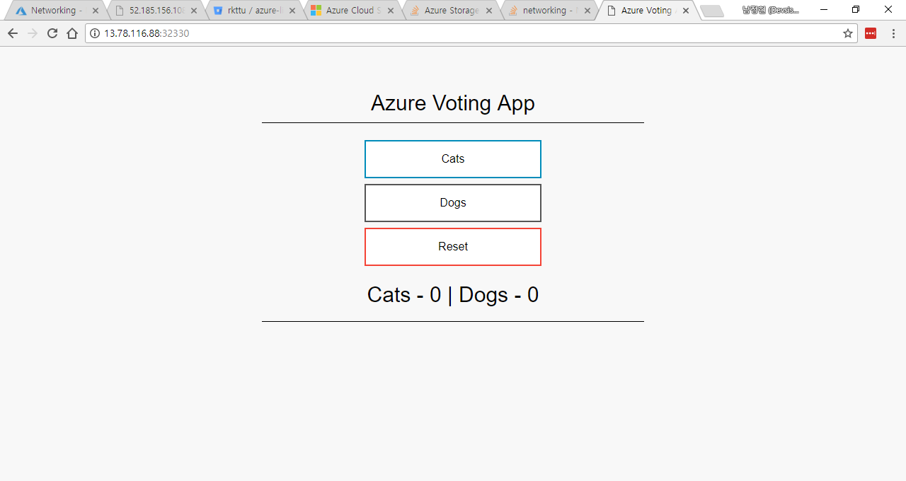

# 4. 실제 애플리케이션 배포하기

만들어진 ARK 클러스터에 Azure Vote App을 실제로 구동해보도록 하겠습니다. 이 App은 백그라운드에서 Redis를 사용하고, 프론트엔드 웹 앱으로 투표에 대한 요청과 응답을 처리하는 간단한 서비스를 제공합니다.

다음과 같이 파일을 작성합니다. 파일 이름은 `azure-vote.yaml` 로 저장합니다.

```yaml
apiVersion: apps/v1beta1
kind: Deployment
metadata:
  name: azure-vote-back
spec:
  replicas: 1
  template:
    metadata:
      labels:
        app: azure-vote-back
    spec:
      containers:
      - name: azure-vote-back
        image: redis
        ports:
        - containerPort: 6379
          name: redis
---
apiVersion: v1
kind: Service
metadata:
  name: azure-vote-back
spec:
  ports:
  - port: 6379
  selector:
    app: azure-vote-back
---
apiVersion: apps/v1beta1
kind: Deployment
metadata:
  name: azure-vote-front
spec:
  replicas: 1
  strategy:
    rollingUpdate:
      maxSurge: 1
      maxUnavailable: 1
  minReadySeconds: 5
  template:
    metadata:
      labels:
        app: azure-vote-front
    spec:
      containers:
      - name: azure-vote-front
        image: microsoft/azure-vote-front:v1
        ports:
        - containerPort: 80
        resources:
          requests:
            cpu: 250m
          limits:
            cpu: 500m
        env:
        - name: REDIS
          value: "azure-vote-back"
---
apiVersion: v1
kind: Service
metadata:
  name: azure-vote-front
spec:
  type: NodePort
  ports:
  - name: http
    port: 80
    targetPort: 80
    protocol: TCP
  selector:
    app: azure-vote-front
```

이제 해당 파일을 커밋하고 아래 단계를 거쳐 Kubernetes 클러스터에 Azure Vote App을 배포해보도록 하겠습니다.

1. `kubectl apply -f azure-vote.yaml` 명령을 입력합니다.

2. `kubectl get pod` 명령을 입력하여 모든 Pod이 Ready 상태로 전환되는 것을 확인합니다.

3. NodePort로 프론트엔드 서비스를 외부에 공개하도록 하였으므로, 서비스가 만든 NodePort 정보를 확인하여 NSG 설정과 로드밸런서 설정을 변경해야 합니다. 아래 정보에서 `azure-vote-front`의 80:32330 부분 중 32330이 실제 클러스터 환경에 노출된 포트입니다.

  **NOTE** 32330은 예제를 실행할 당시의 결과값이며, 실제로는 임의의 포트가 배정됩니다.

  ```text
  kubectl get services
  NAME               TYPE        CLUSTER-IP      EXTERNAL-IP   PORT(S)        AGE
  azure-vote-back    ClusterIP   10.233.43.128   <none>        6379/TCP       8m
  azure-vote-front   NodePort    10.233.31.71    <none>        80:32330/TCP   8m
  kubernetes         ClusterIP   10.233.0.1      <none>        443/TCP        15m
  ```

4. NodePort로 포트를 공개하면 Kubernetes 클러스터에 참여하는 모든 가상 컴퓨터에 동일한 포트가 열리고, 해당 포트에 요청이 들어가면 로드 밸런싱이 이루어지게 됩니다. 이에 따라 다음의 작업을 포털 또는 Azure CI 명령으로 진행하도록 합니다.
  -- 각 가상 컴퓨터에 위에 표시된 것과 같이 32330 TCP 포트에 대한 인바운드 연결을 허용합니다.
  -- 로드밸런서의 Health Check Probe에 32330 TCP 포트를 추가합니다.
  -- 로드밸런서의 규칙에 프론트엔드는 80 TCP 포트, 백엔드는 32330 TCP 포트를 연결하도록 수정합니다.

5. 이제 브라우저에서 개별 가상 컴퓨터의 공개 IP (이 경우는 NodePort에서 할당한 TCP 포트를 지정합니다.) 및 로드 밸런서의 공개 IP 주소로 접속을 시도해봅니다. 아래 그림과 같이 표시가 되면 구성이 잘 된 것입니다.

  

6. Redis 백엔드와 잘 연동이 되었는지 확인해보기 위하여, `Dogs`, `Cats` 버튼을 몇 번 눌러보고, 다른 컴퓨터나 다른 브라우저에서 페이지를 열었을 때에도 값이 잘 유지가 되는지 봅니다.

축하합니다. 여러분께서는 처음으로 클라우드 상에서 실행되는 Kubernetes 클러스터와 그 위에서 실행되는 서비스를 배포하셨습니다.
